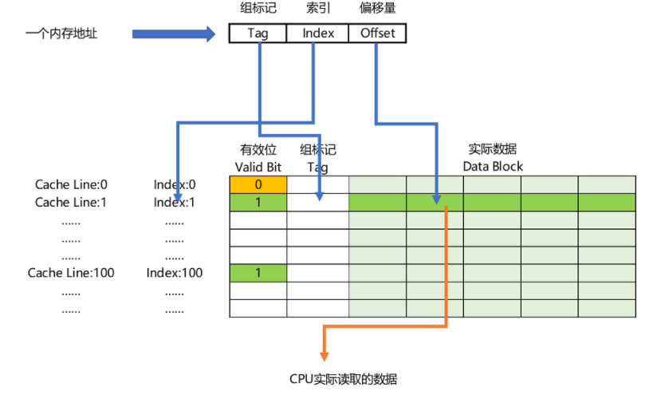

存储地址 = 组标记 + 索引 + 偏移量

**组标记**（Tag），用于与存储块地址建立关联。可以使用存储地址的高位，组标记 + 缓存块二进制 = 内存块。

**有效位**（valid bit），用来标记对应的缓存块中的数据是否是有效，0 无效， 1 有效。

**偏移量**： 用于确认CPU可以读取每个字的位置。 CPU 在读取具体数据时（这个数据叫CPU 里的一个字（Word））。

[[缓存放置策略]]

[[高速缓存与循环]]
