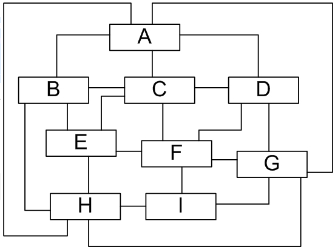
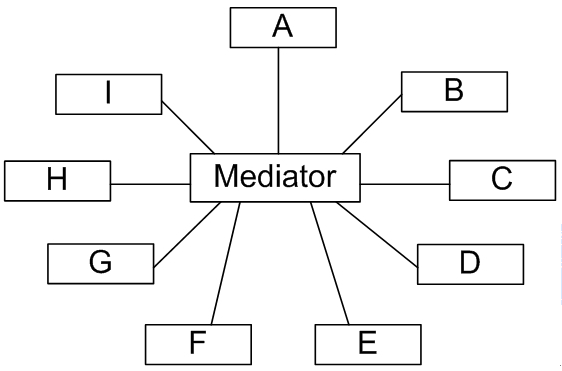
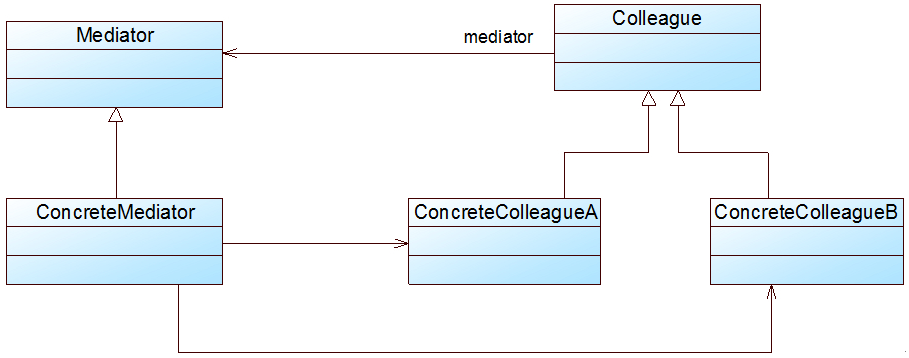

### 中介者模式（Mediator）

如果在一个系统中对象之间的联系呈现为网状结，对象之间存在大量的多对多联系将导致系统非常复杂，以及各组件（各组件简称同事）之间过度耦合。



通过引入中介者对象，可以将系统的网状结构变成以中介者为中心的星形结构。同事对象不再直接与另一个对象联系，而是通过中介者对象与另一个对象发生相互作用。



**中介者模式(Mediator Pattern)**：用一个中介对象（中介者）来封装一系列的对象交互，中介者使各对象不需要显式地相互引用，从而使其耦合松散。主要包含如下几个角色：

**Mediator（抽象中介者）**：用于与各同事对象之间进行通信。

**ConcreteMediator（具体中介者）**：抽象中介者的具体实现，通过维持对各同事对象的引用实现协调行为。

**Colleague（抽象同事类）**：维持了一个对抽象中介者类的引用，方便子类与中介者通信。

**ConcreteColleague（具体同事类）**：抽象同事类的具体实现，通过中介者完成与其他同事的通信。



```java  
abstract class Mediator {
    protected AbstractColleague A;
	protected AbstractColleague B;

    public AbstractMediator(AbstractColleague a, AbstractColleague b) {
		A = a;
		B = b;
	 }
 
	public abstract void AaffectB();
	
	public abstract void BaffectA();
}


class ConcreteMediator extends Mediator {
    public Mediator(AbstractColleague a, AbstractColleague b) {
		super(a, b);
	}
 
	//处理A对B的影响
	public void AaffectB() {
		int number = A.getNumber();
		B.setNumber(number*100);
	}
 
	//处理B对A的影响
	public void BaffectA() {
		int number = B.getNumber();
		A.setNumber(number/100);
	}
}

abstract class Colleague {
    //维持一个抽象中介者的引用
	protected Mediator mediator; 
    // 同事类的内部状态
    protected int number;

    public void  setNumber(int number) {
       this.number = number;
    } 	

	public Colleague(Mediator mediator) {
		this.mediator=mediator;
	}
	
	public abstract void operation ();
	
}

class ConcreteColleagueA extends Colleague {
	public ConcreteColleague(Mediator mediator) {
		super(mediator);
	}
	
    //实现自身方法
	public void operation () {
		mediator. AaffectB();
	}
}

class ConcreteColleagueB extends Colleague {
	public ConcreteColleague(Mediator mediator) {
		super(mediator);
	}
	
    //实现自身方法
	public void operation () {
		mediator. BaffectA ();
	}
}

public class Client {
	public static void main(String[] args){
		Colleague collA = new ConcreteColleagueA();
	    Colleague collB = new ConcreteColleagueB();
		Mediator am = new ConcreteMediator();
        …
		collA. Operation ();
		collB. operation ();
        …
	}
}

```

