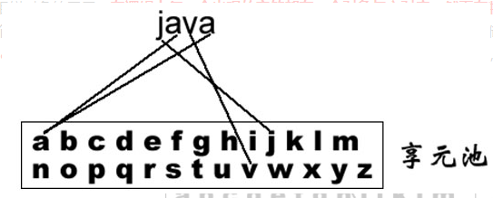
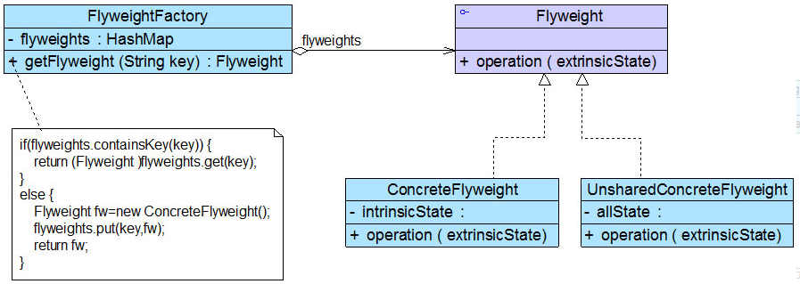

### 享元模式（Flyweight）

享元模式(Flyweight Pattern)：运用共享技术有效地支持大量细粒度对象的复用。比如我们可以针对每一个不同的字符创建一个享元对象，将其放在享元池中，需要时再从享元池取出。在逻辑上每一个出现的字符都有一个对象与之对应，然而在物理上它们却共享同一个享元对象，这个对象可以出现在一个字符串的不同地方，相同的字符对象都指向同一个实例。享元模式中存储这些共享实例对象的地方称为享元池(Flyweight Pool)。



在享元模式结构图中包含如下几个角色：

**Flyweight（抽象享元类）**：一个接口或抽象类声明具体享元类公共的方法，可以用于管理享元对象的内部和外部状态。

**ConcreteFlyweight（具体享元类）**：抽象享元类的具体实现，为内部状态提供了存储空间。

**UnsharedConcreteFlyweight（非共享具体享元类）**：不能被共享的子类

**FlyweightFactory（享元工厂类）**：用于创建并管理享元对象。面向抽象享元类编程，将各种类型的具体享元对象存储在一个享元池中。



```java
 class FlyweightFactory { 

     //享元池
       private HashMap flyweights = newHashMap(); 
       public Flyweight getFlyweight(String key){ 
              if(flyweights.containsKey(key)){
                    return(Flyweight)flyweights.get(key);
              }
              else {
              Flyweight fw = newConcreteFlyweight(); 
                    flyweights.put(key,fw);
                    return fw; 
              }
       }

 }

 class Flyweight { 

      //内部状态
        private String intrinsicState;
        public  Flyweight(String intrinsicState) { 
              this.intrinsicState=intrinsicState; 
        }

        //依据外部状态表现不同的行为 
        public void operation(String  extrinsicState) {
               ......

        }
 }
```
