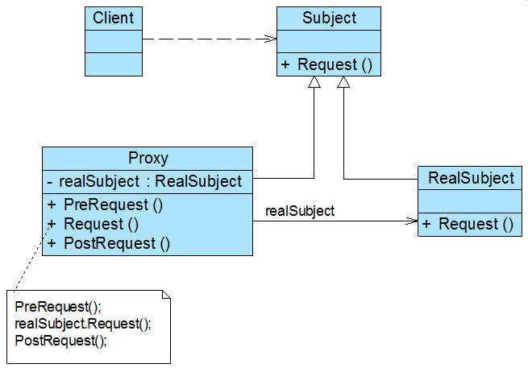

## 代理模式（Proxy）

**Subject**：负责定义RealSubject和Proxy角色应该实现的接口；

**RealSubject**：用来真正完成业务服务功能；

**Proxy**：负责将自身的Request请求，调用realsubject 对应的request功能来实现业务功能。

## 动态代理

动态代理实现了在加载时动态创建代理类的功能。基本流程如下：

1. 动态代理基于invocationHandler 及 RealSubject 动态生成proxy类。
2. 客户端调用proxy
3. 生成的代理类Poxy内部将调用InvocationHandler及RealSubject

动态代理实现的方式方式：

a.定义一个功能接口，然后让Proxy 和RealSubject来实现这个接口。比如JDK动态代理

b.通过继承，让Proxy 继承自RealSubjecct。比如Cglib的动态代理

[[动态代理-cglib]]
[[动态代理-jdk]]