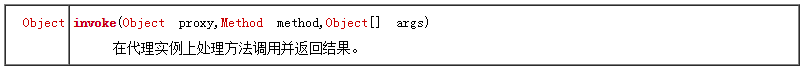
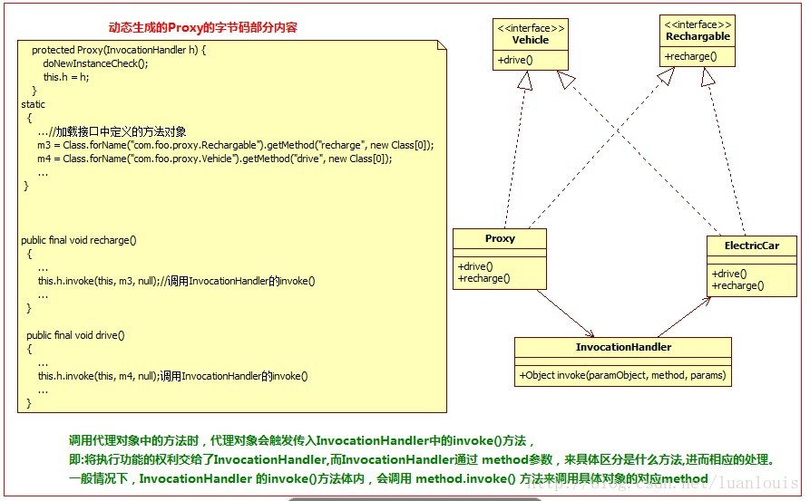

## JDK的动态代理创建机制接口

基本流程
1. 获取RealSubject上的所有接口列表；

2. 确定要生成的代理类的类名，默认为：com.sun.proxy.$ProxyXXXX ；

3. 根据需要实现的接口信息，在代码中动态创建该Proxy类的字节码；

4. 将对应的字节码转换为对应的class 对象；

5. 创建InvocationHandler实例handler，用来处理Proxy所有方法调用；

6. Proxy的class对象以创建的handler对象为参数，实例化一个proxy对象。

关键接口：

java.lang.reflect.Proxy#newProxyInstance 


java.lang.reflect.InvocationHandler#invoke



关键代码

```java
 // 真实对象 
 
 ElectricCar car = new ElectricCar();
  
 Advice advice = new LogAdvice();
 ClassLder classLder = car.getClass().getClassLder();
 Class[] interfaces = car.getClass().getInterfaces();
 InvocationHandler handler = new ElectricCarInvocationHandler(car, advice);
 Object o = Proxy.newProxyInstance(classLder, interfaces, handler);

 Vehicle vehicle = (Vehicle) o;
 vehicle.drive();
 Rechargeable rechargeable = (Rechargeable) o; 
 rechargeable.recharge();
```

代理类的关键结构

1. 继承自 java.lang.reflect.Proxy，与真实对象实现相同的接口；

2. 类中的所有方法都是final 的；

3. 所有的方法功能的实现都统一调用了InvocationHandler的invoke()方法。



缺点：真实类必须基于接口实现，且代理类必须与真实类实现相同的接口