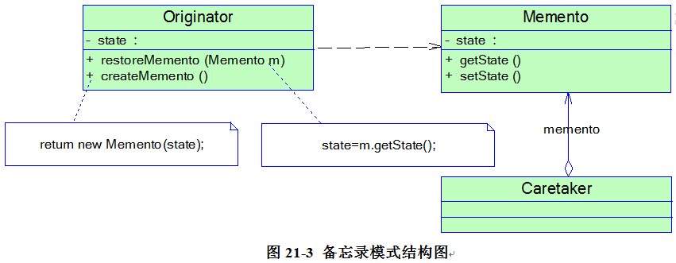

### 备忘录模式（Memento）

使用独立于实例的新对象保存其状态。
> 备忘录模式(Memento Pattern)：在不破坏封装的前提下，捕获一个对象的内部状态，并在该对象之外保存这个状态，这样可以在以后将对象恢复到原先保存的状态。

Originator（原发器）：需要保存内部状态的类
Memento（备忘录)：保存状态的抽象类或接口
Caretaker（负责人）：具体备忘录的实现



```java
 class Client {
    public static void main(String args[]) {
        Caretaker mc = new Caretaker(); 
        Originator chess = new Originator(); 
        chess.setState("x") 
        mc.setMemento(chess. createMemento ()); //保存状态
        chess. restoreMemento (mc.getMemento()); //恢复状态 
    }
}
 
```