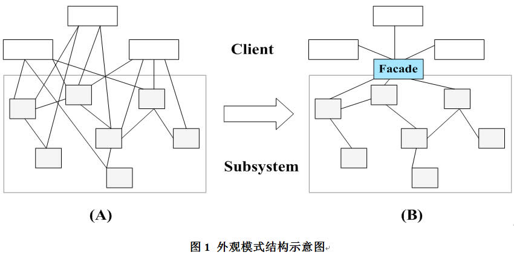
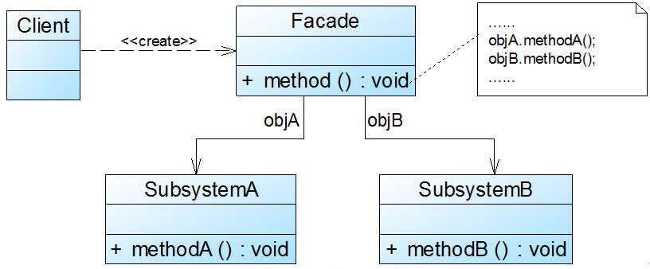

### 外观模式（Facade）

外观模式（Facade）：为子系统中的一组接口提供一个一致的入口，定义了一个高层接口，这个接口使得相关子系统更加容易使用。

在外观模式结构图中包含如下几个角色：

**Facade（外观角色）**：客户端可以调用这个角色的方法，将所有从客户端发来的请求委派到相应的子系统去，传递给相应的子系统对象处理。

**Subsystem（子系统角色）**：在软件系统中可以有一个或者多个子系统角色，每一个子系统可以不是一个单独的类，而是一个类的集合，它实现子系统的功能；每一个子系统都可以被客户端直接调用，或者被外观角色调用，它处理由外观类传过来的请求；子系统并不知道外观的存在，对于子系统而言，外观角色仅仅是另外一个客户端而已。

