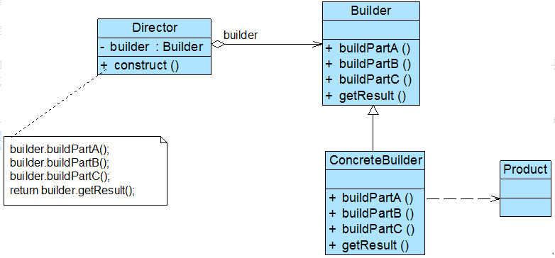

### 建造者模式（Builder）

建造者模式(Builder Pattern)：将一个复杂对象的构建与它的表示分离，使得同样的构建过程可以创建不同的表示。在建造者模式结构图中包含如下几个角色：

**Product（产品角色）**：需要被构建的复杂对象，包含多个组成部件。由具体建造者创建该产品的内部表示并定义它的装配过程。

**Builder（抽象建造者）**：创建一个Product对象的各个部件指定抽象接，通常包含两类方法：1、buildPartX()用于创建复杂对象的各个部件；2、getResult()用于返回复杂对象。

**ConcreteBuilder（具体建造者）**：定义并明确它所创建的复杂对象。

**Director（指挥者）**：指挥者又称为导演类，负责安排复杂对象的**建造次序**，通过在其construct()建造方法中调用建造者对象的部件构造与装配方法，完成复杂对象的建造。



```java
class Product{
 privateString partA; 
 privateString partB;
 privateString partC;
}


abstract class Builder {
 //创建产品对象
 protectedProduct product =new Product();
 
 publicabstract void buildPartA();
 publicabstract void buildPartB();
 publicabstract void buildPartC();

 //返回产品对象
 publicProduct getResult() {
returnproduct;
 }
}

// 具体建造者
Class ConcreteBuilder {
 Public void buildePartA() {
 Product.setPartA(xxx);
 }

 Public void buildePartB() {
 Product.setPartB(xxx);
 }

 Public void buildePartC() {
 Product.setPartC(xxx);
 }
}

class Director {
 privateBuilder builder;

 publicDirector(Builder builder) {
this.builder=builder;
 }
 publicvoid setBuilder(Builder builder) {
this.builder=builer;
 }

 //产品构建与组装方法
 public Product construct() {
builder.buildPartC();
builder.buildPartA();
builder.buildPartB();
return builder.getResult();
 }
}

Public class Client {
 public static void main(String[] args) {
		Builderbuilder = new ConcreteBuilder();
Director director = newDirector(builder);
Product product = director.construct();
	} 
}

```