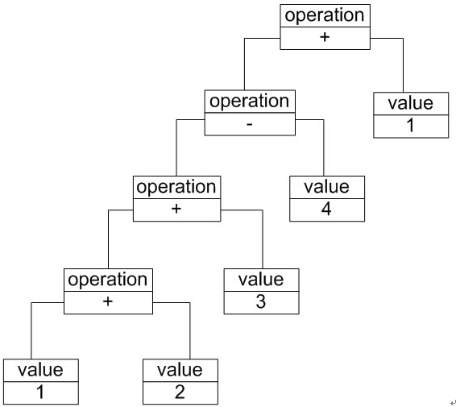

### 文法规则与抽象树
在加法/减法解释器中，每一个输入表达式，例如"1 + 2 + 34 + 1"，都包含了三个语言单位，可以使用如下文法规则来定义：

```
 expression ::= valueoperation
 operation ::= expression '+' expressionexpression '' expression 
 value ::= an integer //一个整数值
```

expression ::= valueoperation表示表达式的组成方式，其中value和operation是后面两个语言单位的定义。每一条语句所定义的字符串如operation和value称为语言构造成分或语言单位。符号"::="表示"定义为"的意思，其左边的语言单位通过右边来进行说明和定义。语言单位对应终结符表达式和非终结符表达式，如本规则中的operation是非终结符表达式，它的组成元素仍然可以是表达式，可以进一步分解，而value是终结符表达式，它的组成元素是最基本的语言单位，不能再进行分解。

在文法规则定义中可以使用一些符号来表示不同的含义，如使用""表示或，使用""表示组合，使用"\*"表示出现0次或多次等，其中使用频率最高的符号是表示"或"关系的""，如文法规则"boolValue ::= 01"表示终结符表达式boolValue的取值可以为0或者1。

除了使用文法规则来定义一个语言，在解释器模式中还可以通过一种称之为抽象语法树(Abstract Syntax Tree, AST)的图形方式来直观地表示语言的构成，每一棵抽象语法树对应一个语言实例，如加法/减法表达式语言中的语句"1+ 2 + 34 + 1"，可以通过如下所示的抽象语法树来表示：



在该抽象语法树中，可以通过终结符表达式value和非终结符表达式operation组成复杂的语句都可以表示为一个抽象语法树。在图中终结符表达式类的实例作为树的叶子节点，而非终结符表达式类的实例作为非叶子节点。抽象语法树描述了如何构成一个复杂的句子，通过对抽象语法树的分析，可以识别出语言中的终结符类和非终结符类。