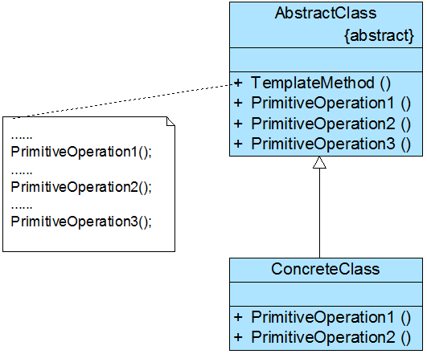

### 模板方法模式（Template Method）

**模板方法模式（Template Method Pattern）**：定义一个操作中算法的框架，而将一些步骤延迟到子类中。主要包含如下两个角色：

 **AbstractClass（抽象类）**：定义一系列基本操作(PrimitiveOperations)以及一个模板方法(Template Method)。

**ConcreteClass（具体子类）**：抽象类的具体实现，用于实现在父类中声明的抽象基本操作以完成子类特定算法的步骤。



 

```java
 public abstract class HummerModel { 
 
 protected abstract void start(); //发动 
 
 protected abstract void stop(); //停止
 
 protected abstract void alarm(); //鸣笛 
 
 protected abstract void engineBoom(); //轰鸣
 
 final public void run() { //车总归要跑
 
 this.start(); 
 
 this.engineBoom();
 
 this.alarm(); 
 
 this.stop();
 
 } 
 
 public class HummerH1 extends HummerModel { 
 
 private boolean alarmFlag = true; //判断标记
 
 @Override
 
 public void start() { 
 
 } 
 
 @Override
 
 public void stop() {
 
 } 
 
 @Override
 
 public void alarm() { 
 
 } 
 
 @Override
 
 public void engineBoom() {
 
 } 
 
 } 
 
 public class Test { 
 
 public static void main(String[] args) throws IOException { 
 
 HummerH1 h1 = new HummerH1(); 
 
 h1.run(); 
 
 } 
 
 } 
```
