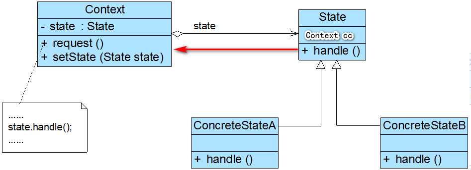
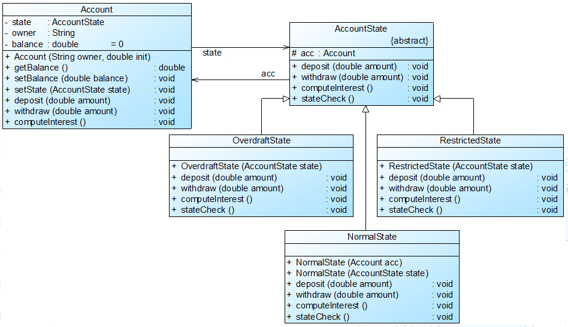

### 状态模式（State）
主体对象的行为与其状态相关联

> **状态模式(State Pattern)**：对象在其内部状态改变时改变它的行为。

**Context（环境类）**：状态主体
**State（抽象状态类）**：对主体在不同状态下行为的抽象
**ConcreteState（具体状态类）**：抽象状态类的具体实现



```java
 class Client { 

    public static void main(String args[]) { 
        Context cc = new Context(10); 
        cc.setState(new ConcreteStateA())
        cc.requestA(); 
        cc.requestB(); 
    }

}

class Context {

    private State state; 
    private int value; 
    public Context(int value) {
        this.value = value;
    }

    //设置状态对象 
    public void setState(State state) {
        this.state = state;
    }

    public void requestA() { 
        ...
        //调用状态对象的业务方法 
        state.handleA(); 
        ...
    }

    public void requestB() { 

        ...
        //调用状态对象的业务方法 
        state.handleB(); 
        ...
    }

}

 /**
 * 声明抽象业务方法，不同的具体状态类可以不同的实现 
 **/
abstract class State {
    // 状态主体
    protected Context cc;

    // 状态主体的行为
    public abstract void handleA();
    public abstract void handleB();

    // 状态迁移
    public abstract void stateCheck(); 
}

class ConcreteStateA extends State {

    public ConcreteStateA(Context cc) { 
        this.cc = cc;
    }

    public ConcreteStateA(State state) {
        this.cc = state.cc;
    }

    public void handleA() {
        cc.value = 0;
        //状态流转 
        stateCheck();
    }

    public void handleB() {
        throw new Exception("此操作不允许"); 
    }

    public void stateCheck() { 

        if(cc.vaue > 0) { 
            cc.setState(new ConcreteStateB(this))
        } else if (cc.value == 0) {
            cc.setState(new ConcreteStateA(this))
        }

    }

}

```

案例类图


> 账户存在多种状态：逾期、正常、受限
> 在不同状态下账户的行为（提现、计息、转账等）会有所不同。
