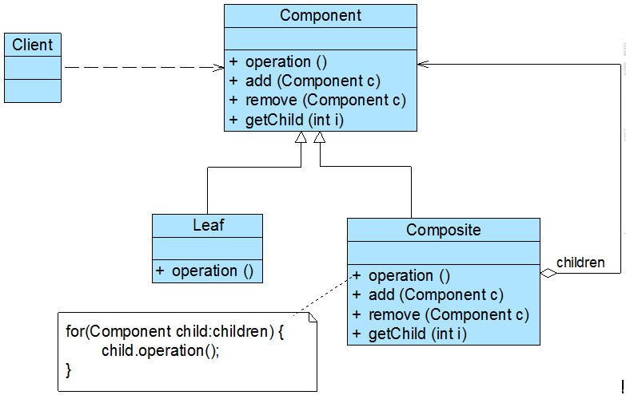

### 组合模式（Composite）

组合模式(Composite Pattern)：组合多个对象形成树形结构以表示具有"整体部分"关系的层次结构。组合模式对单个对象（即叶子对象）和组合对象（即容器对象）的使用具有一致性（比如文件夹与文件）。主要包含如下几个角色：

**Component（抽象构件）**：为叶子构件和容器构件对象声明接口，包含所有子类共有行为的声明和实现。

**Leaf（叶子构件）**：表示组合结构的叶子节点对象，叶子节点没有子节点。

**Composite（容器构件）**：表示组合结构的容器节点对象，它提供一个集合用于存储子节点。

组合模式的关键是定义了一个**抽象构件类**，它既可以代表叶子，又可以代表容器。客户端针对该抽象构件类进行编程，无须知道它到底表示的是叶子还是容器，可以对其进行统一处理。同时容器对象与抽象构件类之间还建立一个聚合关联关系，在容器对象中既可以包含叶子，也可以包含容器，以此实现递归组合，形成一个树形结构。



```java
 abstract class Component { 

 //增加成员 

 public abstract void add(Component c); 

 //删除成员 

 public abstract void remove(Component c);

 //获取成员 

 public abstract Component getChild(int i); 

 //业务方法 

 public abstract void operation();

 }

 class Leaf extends Component { 

 public void add(Component c) { 

 }

 public void remove(Component c) {

 }

 public Component getChild(int i) { 

 return null; 

 }

 public void operation() {

 }

 }

 class Composite extends Component {

 private ArrayList<Component> list = new ArrayList<>(); 

 public void add(Component c) { 

 list.add(c); 

 }

 public void remove(Component c) {

 list.remove(c);

 }

 public Component getChild(int i) { 

 return (Component)list.get(i); 

 }

 public void operation() {

 //容器构件具体业务方法的实现 

 //递归调用成员构件的业务方法 

 for(Object obj:list) { 

 ((Component)obj).operation();

 }

 }

 }

```
