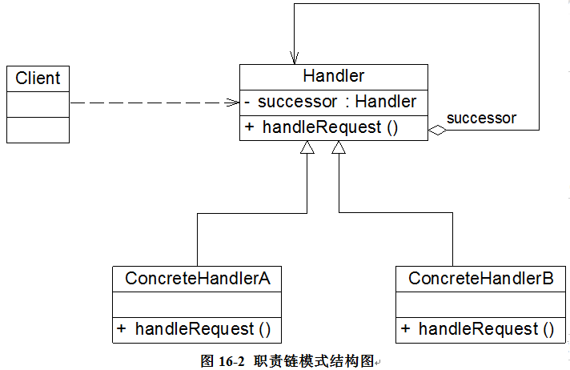

### 职责链模式（Chain of Responsibility）

职责链模式(Chain of Responsibility Pattern)：让多个都有可能接收请求的对象连接成一条链，然后沿着这条链传递请求，直到有对象处理它为止。主要包含如下几个角色：

**Handler（抽象处理者）**：处理请求的抽象类。通过在抽象处理者中定义了一个抽象处理者类型的对象（如结构图中的successor），可以将所有处理者可以连成一条链。

**ConcreteHandler（具体处理者）**：抽象处理者的具体实现，在处理请求之前需要进行判断是否有相应的处理权限，如果可以处理请求就处理它，否则将请求转发给后继者。



```java
abstract class Handler {
	//维持对下家的引用
    protected Handler successor;
	
	public void setSuccessor(Handler successor) {
		this.successor=successor;
	}
	
	public abstract void handleRequest(String request);
}

class ConcreteHandler extends Handler {

	public void handleRequest(String request) {
		if (请求满足条件) {
			//处理请求
		}
		else {
			this.successor.handleRequest(request);  //转发请求
		}
	}
}
```
