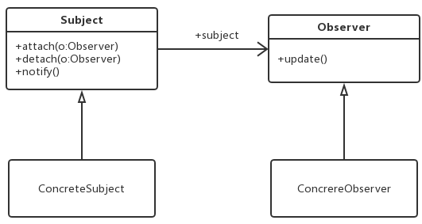

### 观察者模式（Observer）
目标的状态发生改变将通知对其感兴趣的对象。

> **观察者模式(Observer Pattern)**：定义对象之间一对多依赖关系，当对象状态发生改变时使得依赖能获取到通知。

**Subject（目标）**：目标又称为主题，指被观察的对象。
**ConcreteSubject（具体目标）**：目标类的具体实现，当它的状态发生改变时向各个观察者发出通知。
**Observer（观察者）**：观察者将对观察目标的改变做出反应，声明了更新数据的方法。
**ConcreteObserver（具体观察者）**：观察者的具体实现。



```java
import java.util.*; 

abstract class Subject {

	//定义一个观察者集合用于存储所有观察者对象 
	protected ArrayList observers<Observer> = new ArrayList(); 

	//注册方法，用于向观察者集合中增加一个观察者 
	public void attach(Observer observer) {
		observers.add(observer); 
	}

	//注销方法，用于在观察者集合中删除一个观察者 

	public void detach(Observer observer) {
		observers.remove(observer);
	}

	//声明抽象通知方法 
	public abstract void notify(); 

}

class ConcreteSubject extends Subject {

	//实现通知方法 
	public void notify() {
		 //遍历观察者集合，调用每一个观察者的响应方法 
		 for(Object obs:observers) {
		 	((Observer)obs).update();
		 }

	}

}

interface Observer { 
	//声明响应方法 
	public void update();

}

class ConcreteObserver implements Observer { 

	//实现响应方法 
	public void update() { 
	//具体响应代码 
	}

}
```

[[JDK_观察者模式]]