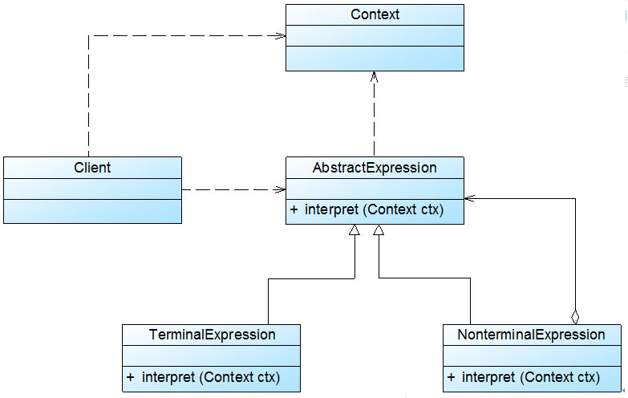

#### 解释器模式
[[文法规则与抽象树]]
解释器模式用于描述如何使用面向对象语言构成一个简单的语言解释器。在某些情况下，为了更好地描述某一些特定类型的问题，我们可以创建一种新的语言，这种语言拥有自己的表达式和结构，即文法规则，这些问题的实例将对应为该语言中的句子。

**解释器模式(Interpreter Pattern)**：定义一个语言的文法，并且建立一个解释器来解释该语言中的句子，这里的"语言"是指使用规定格式和语法的代码。主要包含如下角色：

**AbstractExpression（抽象表达式）**：所有终结符表达式和非终结符表达式的公共父类。

**TerminalExpression（终结符表达式）**：抽象表达式的具体实现，实现了与文法中的终结符相关联的解释操作，在句子中的每一个终结符都是该类的一个实例。

**NonterminalExpression（非终结符表达式）**：抽象表达式的具体实现，实现了文法中非终结符的解释操作。

**Context（环境类）**：环境类又称为上下文类，用于存储解释器之外的一些全局信息，通常它临时存储了需要解释的语句



 

```java
 abstract class AbstractExpression { 
 
 public abstract void interpret(Context ctx);
 
 } 
 
 class TerminalExpression extends  AbstractExpression {
 
        public  void interpret(Context ctx) {
 
               //终结符表达式的解释操作
 
        }
 
 } 
 
 class NonterminalExpression extends  AbstractExpression { 
 
        private  AbstractExpression left;
 
        private  AbstractExpression right; 
 
        public  NonterminalExpression(AbstractExpression left, AbstractExpression right) { 
 
               this.left=left; 
 
               this.right=right; 
 
        }
 
        public void interpret(Context ctx) { 
 
               //递归调用每一个组成部分的interpret()方法 
 
               //在递归调用时指定组成部分的连接方式，即非终结符的功能
 
        }      
 
 } 
 
 class Context { 
 
      private HashMap map = new HashMap(); 
 
      public void assign(String key, String value) { 
 
          //往环境类中设值 
 
      }
 
 public String  lookup(String key) { 
 
          //获取存储在环境类中的值 
 
      }
 
 }
```