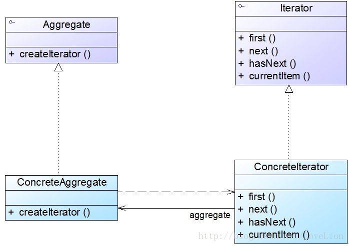

### 迭代器模式（Iterator）

**迭代器模式(Iterator Pattern)**：提供一种方法来访问聚合对象，而不用暴露这个对象的内部表示（别名为游标）。聚合对象是指用于存储一系列数据的对象主要包括如下两个职责：一是存储数据；二是遍历数据。主要包含如下几个角色：

**Iterator（抽象迭代器）**：定义了访问和遍历元素的接口，声明了用于遍历数据元素的方法。

**ConcreteIterator（具体迭代器）**：抽象迭代器的具体实现，完成对聚合对象的遍历。通过游标来记录在聚合对象中所处的当前位置。

**Aggregate（抽象聚合类）**：用于存储和管理元素对象，声明一个createIterator()方法用于创建一个迭代器对象，充当抽象迭代器工厂角色。

**ConcreteAggregate（具体聚合类）**：实现了在抽象聚合类中声明的createIterator()方法，该方法返回一个与该具体聚合类对应的具体迭代器ConcreteIterator实例。



```java
 interface Iterator {
 
 public void first(); //将游标指向第一个元素 
 
 public void next(); //将游标指向下一个元素
 
 public boolean hasNext(); //判断是否存在下一个元素
 
 public Object currentItem(); //获取游标指向的当前元素 
 
 } 
 
 class ConcreteIterator implements Iterator {
 
 //维持一个对具体聚合对象的引用
 
 private ConcreteAggregate objects;
 
 //定义一个游标，用于记录当前访问位置
 
 private int cursor; 
 
 public ConcreteIterator(ConcreteAggregate objects) {
 
 this.objects=objects; 
 
 } 
 
 public void first() 
 
 public void next()
 
 public boolean hasNext()
 
 public Object currentItem() 
 
 } 
 
 interface Aggregate { 
 
 Iterator createIterator();
 
 } 
 
 class ConcreteAggregate implements Aggregate {
 
 ......
 
 public Iterator createIterator() {
 
 return new ConcreteIterator(this);
 
 } 
 
 ......
 
 } 
```
