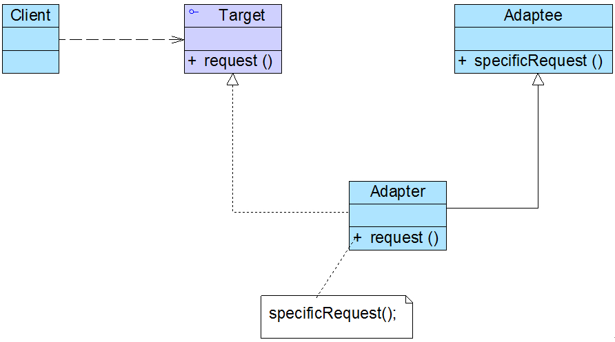

### 适配器模式（Adapter）

适配器模式(Adapter Pattern)：将一个接口转换成客户希望的另一个接口，使接口不兼容的那些类可以一起工作。根据适配器类与适配者类的关系不同，适配器模式可分为对象适配器和类适配器两种。在对象适配器模式中，适配器与适配者之间是关联关系；在类适配器模式中，适配器与适配者之间是继承关系。主要包含如下几个角色：

**Target（目标抽象类）**：目标抽象类定义客户所需接口。

**Adapter（适配器类）**：通过调用另一个接口实现转换功能。

**Adaptee（适配者类）**：定义了一个已经存在的接口。

#### 对象适配器

在对象适配器中，客户端需要调用request()方法，而适配者类Adaptee提供的specificRequest()方法却是客户端所需的。因此为了使客户端能够使用**适配者类**，需要提供一个适配器类Adapter。这个适配器类包装了一个适配者的实例，从而将客户端与适配者衔接起来，在适配器的request()方法中调用适配者的specificRequest()方法。

#### 类适配器

类适配器模式和对象适配器模式最大的区别在于[]，对象适配器模式中适配器和适配者之间是关联关系，而类适配器模式中适配器和适配者是继承关系。

