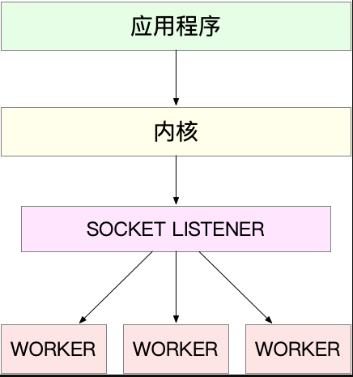
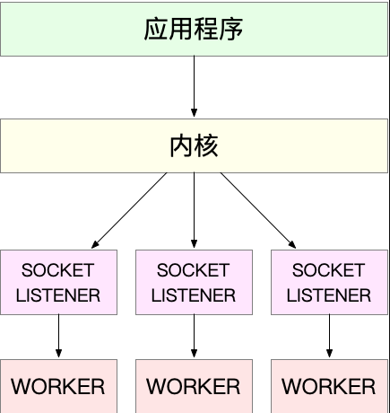
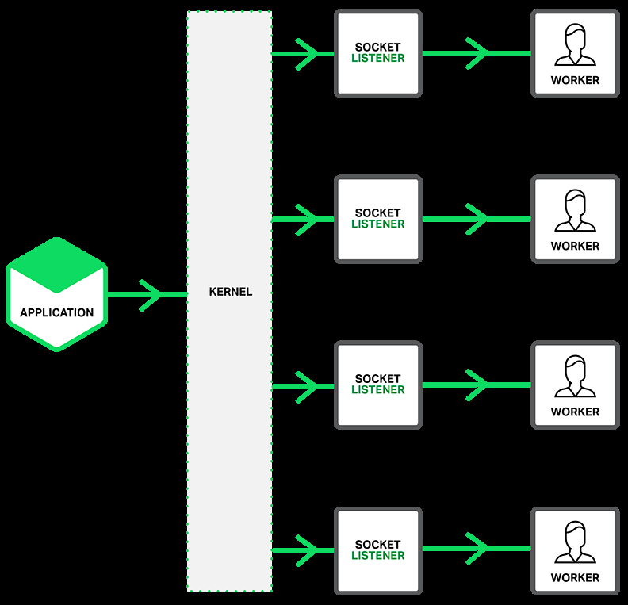

从资源上来说，对 2GB 内存和千兆网卡的服务器来说，同时处理 10000 个请求，只要每个请求处理占用不到 200KB（2GB/10000）的内存和 100Kbit （1000Mbit/10000）的网络带宽就可以。

IO模型**非阻塞 I/O 和边缘触发通知**

/进程模型

### 非阻塞I/O + readiness notification +多进程

- 主进程执行 bind() + listen() 后，创建多个子进程；

- 然后，在每个子进程中，都通过 accept() 或 epoll_wait() ，来处理相同的套接字。

  比如，反向代理服务器 Nginx。由主进程和多个 worker 进程组成。主进程主要用来初始化套接字，并管理子进程的生命周期；而 worker 进程，则负责实际的请求处理。

这里要注意，accept() 和 epoll_wait() 调用，还存在一个惊群的问题。换句话说，当网络 I/O 事件发生时，多个进程被同时唤醒，但实际上只有一个进程来响应这个事件，其他被唤醒的进程都会重新休眠。

- 其中，accept() 的惊群问题，已经在 Linux 2.6 中解决了；
- 而 epoll 的问题，到了 Linux 4.5 ，才通过 EPOLLEXCLUSIVE 解决。

为了避免惊群问题， Nginx 在每个 worker 进程中，都增加一个了全局锁（accept_mutex）。这些 worker 进程需要首先竞争到锁，只有竞争到锁的进程，才会加入到 epoll 中，这样就确保只有一个 worker 进程被唤醒。

> nginx采用多reactor多进程（线程或进程可以由程序决定，c语言），nginx与标准的多reactor多进程有差异，具体表现在主进程中没有accept连接，而是由子进程的reactor来accept连接，通过锁来控制一次只有一个子进程accept，子进程accept成功后就放到自己的reactor进行处理。

>  C10K问题是由一个叫Dan Kegel的工程师提出并总结归纳的http://www.kegel.com/c10k.html

### 监听到相同端口的多进程模型

在这种方式下，所有的进程都监听相同的接口，并且开启 SO_REUSEPORT 选项，由内核负责将请求负载均衡到这些监听进程中去。这一过程如下图所示

由于内核确保了只有一个进程被唤醒，就不会出现惊群问题了。比如，Nginx 在 1.9.1 中就已经支持了这种模式。

> 注意，想要使用 SO_REUSEPORT 选项，需要用 Linux 3.9 以上的版本才可以