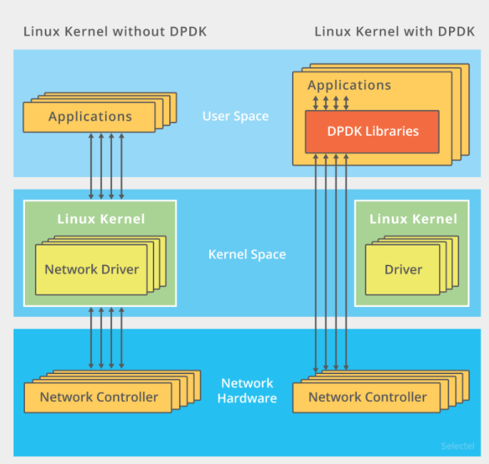
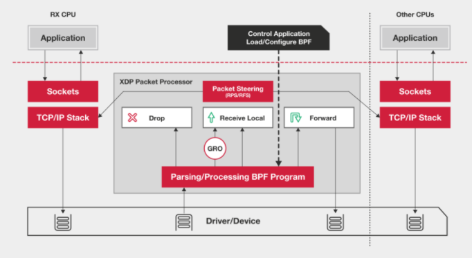

实际上，在 C1000K 问题中，各种软件、硬件的优化很可能都已经做到头了。特别是当升级完硬件（比如足够多的内存、带宽足够大的网卡、更多的网络功能卸载等）后，你可能会发现，无论你怎么优化应用程序和内核中的各种网络参数，想实现 1000 万请求的并发，都是极其困难的。

究其根本，还是 Linux 内核协议栈做了太多太繁重的工作。从网卡中断带来的硬中断处理程序开始，到软中断中的各层网络协议处理，最后再到应用程序，这个路径实在是太长了，就会导致网络包的处理优化，到了一定程度后，就无法更进一步了。

要解决这个问题，最重要就是跳过内核协议栈的冗长路径，把网络包直接送到要处理的应用程序那里去。这里有两种常见的机制，DPDK 和 XDP。

第一种机制，DPDK，是用户态网络的标准。它跳过内核协议栈，直接由用户态进程通过轮询的方式，来处理网络接收。DPDK 还通过大页、CPU 绑定、内存对齐、流水线并发等多种机制，优化网络包的处理效率。

第二种机制，XDP（eXpress Data Path），则是 Linux 内核提供的一种高性能网络数据路径。它允许网络包，在进入内核协议栈之前，就进行处理，也可以带来更高的性能。XDP 底层基于 Linux 内核的 eBPF 机制实现的。XDP 对内核的要求比较高，需要的是 Linux 4.8 以上版本并且它也不提供缓存队列。

