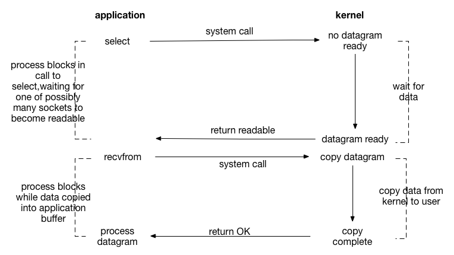
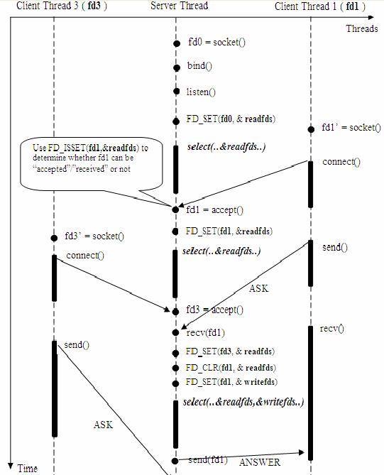

## IO多路复用（IO Multiplexing）
I/O多路复用（也叫事件驱动I/O）通过系统调用`select()`、`poll`、或者`epoll()`实现一个进程同时检查多个文件描述符，以找出其中任何一个是否可执行I/O操作。

`select()`和`poll()`的原理：

1. 注册待侦听的fd
2. 循环检查已注册到`selector`上的`fd`的状态，如果发现已就绪的`fd`或超时就返回

在服务端的多路复用的IO模型下，如果把套接字设置为阻塞。当`select`由结果返回，但当轮询到该事件时因客户端发生了`RST`分节，导致该链接被接收端内核从已完成的队列中删除。
此时再调用`accept`会导致服务端IO线程一直阻塞。并不再对其他的IO事件进行分发。此时如果套接字设置的是非阻塞则只要正确的返回异常即可。

[[客户端RST]]

[[Select]]

[[Poll]]

[[Epoll]]

[[Reactor设计模式]]