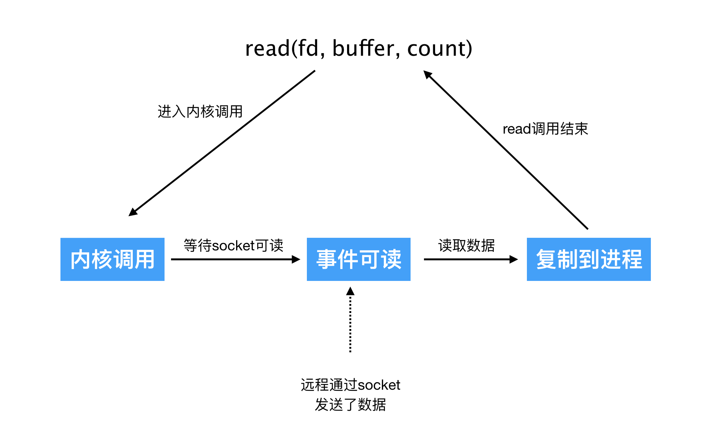
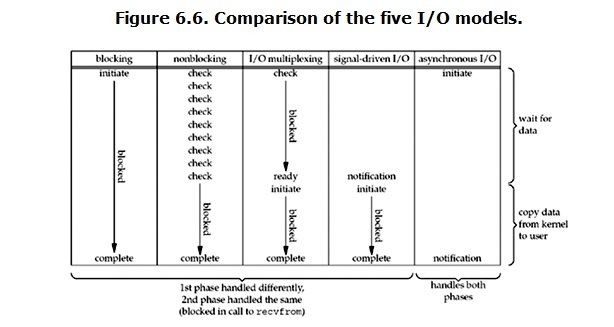

# Unix/Linux 中的五种 I/O 模型

在Unix/Linux环境中为网络编程提供了五种不同的IO模型，分别是阻塞式IO、非阻塞式IO、IO多路复用、信号驱动式IO和异步IO。

网络套接字的输入：

1. 等待数据准备好，用户态进程通过系统调用切换到内核态，并等待数据到达。当数据到达时数据被缓存在内核的缓冲区中
2. 从内核向进程复制数据，将数据从内核缓冲区复制到进程缓冲区。

阻塞IO和非阻塞IO的区别：调用blocking IO会一直block住对应的进程直到操作完成，而non-blocking IO在kernel还在准备数据的情况下会立刻返回。 

同步IO和异步IO的区别：**两者的区别就在于synchronous IO做”IO operation”的时候会将process阻塞。**

[[阻塞IO与非阻塞IO]]

[[IO多路复用]]

[[信号驱动IO模型]]

[[异步IO]]
