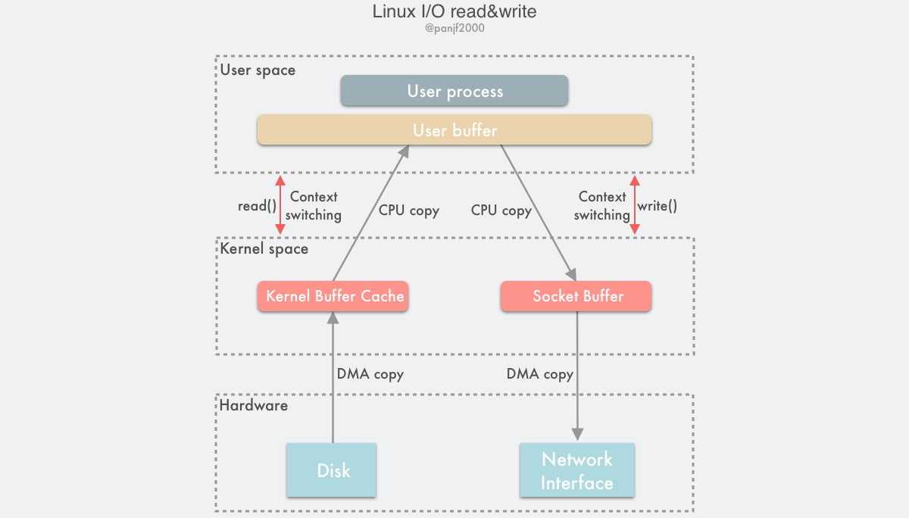

## Linux I/O 流程

Linux 中传统的 I/O 通过 `read()/write()` 系统调用完成读写操作。`read()` 把数据从存储器 (磁盘、网卡等) 读取到用户缓冲区，`write()` 则是把数据从用户缓冲区写出到存储器：

```c
#include <unistd.h>

ssize_t read(int fd, void *buf, size_t count);
ssize_t write(int fd, const void *buf, size_t count);
```


[[IO模型]]

因此一次完整的读磁盘文件然后写出到网卡的底层传输过程如下：



总结：
> 本次读写过程中一共触发了：
> 1. 4 次用户态和内核态的上下文切换，分别是 `read()/write()` 调用和返回时的切换。
> 2. 4次拷贝操作2 次 DMA 拷贝，2 次 CPU 拷贝。

[[零拷贝]]