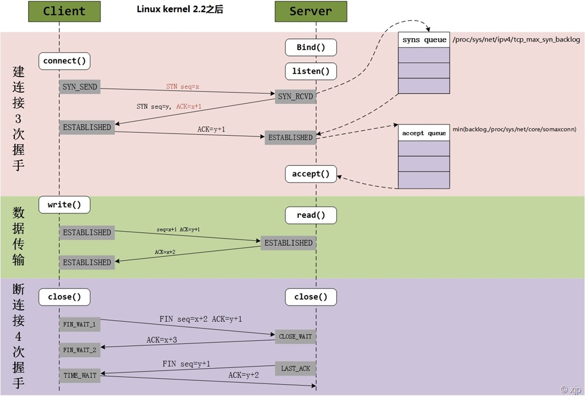
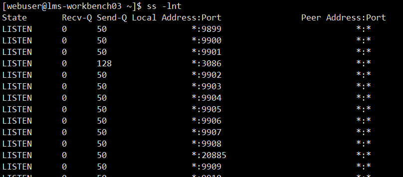

第一次握手：server收到client的syn，然后把相关信息放到**半连接队列**中；如果半连接队列满了则客户端收到错误：connection time out。
> 设置syncookies=1即表示SYN半连接队列就没有逻辑上的最大值。

第二次握手：client收到server的syn+ack；

第三次握手：server收到client的ack。然后把相关信息放到**全连接队列**中。如果全连接队列没有满则从半连接队列拿出相关信息放入到全连接队列中。

> 如果全连接队列已经满了则根据 `/proc/sys/net/ipv4/tcp_abort_on_overflow`的策略进行处理：
> -   0 表示服务端将稍后再重新发送syn+ack，重试第二次握手。客户端超时时间设置比较短则会收到错误：read timeout
> -   1 表示如果全连接队列满了，server发送一个reset包给client，表示废掉这个握手过程和这个连接。客户端收到错误：connection reset by peer

半连接队列：syn squeue用于保存 SYN_SENT 以及 SYN_RECV 的信息。

```
(roundup_pow_of_two(max_t(u32,min(somaxconn,sysctl_max_syn_backlog,backlog),8) +1))
```

全连接队列：accept queue，用于保存 ESTAB 的状态。
```
(min(somaxconn, backlog))
```

-   tcp_max_syn_backlog参数位于/proc/sys/net/ipv4/tcp_max_syn_backlog，默认是128，可以通过/etc/sysctl.conf文件调整。

-   somaxconn参数位与/proc/sys/net/core/somaxconn，默认是128, 表示最多有129个established链接等待accept。可以通过/etc/sysctl.conf文件调整。

-   backlog参数这个和具体的应用程序有关。

> nginx默认511，可以修改backlog 以及 somaxconn
>
> Tomcat默认100，可修改server.xml中的`<Connector acceptCount="300"/>`

有效连接队列大小查看命令： ss -lnt 的 Send-Q 



注：syn floods 攻击就是攻击方不停地向发起服务端建立连接请求，但客户端收到服务端的syn+ack后不进行第三部确认操作。从而导致服务端的半连接队列溢出。

连接队列的溢出数据统计: netstat -s

```
  667399 times the listen queue of a socket overflowed
```

连续查看多次，检查溢出数据是否逐渐增加


[[数据包的接收过程]]

[[数据包的发送过程]]