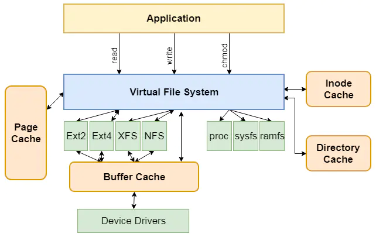

Linux为了兼容不同的文件系统（比如NTFS, FAT, ext3, ext4）给内核和用户进程提供统一的文件系统视图。在用户进程和底层文件系统之间加入了一层，虚拟文件系统(Virtual File System, VFS)抽象。
进程所有的文件操作都通过VFS，由VFS来适配各种底层不同的文件系统，完成实际的文件操作。

## 虚拟文件系统主要模块

1. 超级块（super_block），用于保存一个文件系统的所有元数据，常驻内存并被缓存的。

2. 目录项模块，管理路径的目录项。比如一个路径 /home/foo/hello.txt，那么目录项有home, foo, hello.txt。

3. inode模块，inode可以方便的找到文件在磁盘扇区的位置。同时inode模块可链接到address_space模块，方便查找自身文件数据是否已经缓存。

4. 打开文件列表模块，包含所有内核已经打开的文件（已打开的文件也叫文件句柄）

5. file_operations模块。一系列函数指针的集合，其中包含所有可以使用的系统调用函数，例如open、read、write、mmap等。

6. dress_space模块，表示一个文件在页缓存中已经缓存了的物理页。链接到页缓存基数树和inode

1. 每个模块都维护了一个X_op指针指向对应的操作对象X_operations。

2. 超级块维护了一个s_files指针指向了“已打开文件列表模块”，即内核所有的打开文件的链表，所有进程共享的。

   > 一个进程可以多次打开一个文件，生成不同的文件描述符，每个文件描述符指向不同的文件列表表项。但是由于是同一个文件，inode唯一，所以这些文件列表表项都指向同一个inode。通过这样的方法实现文件共享（共享同一个磁盘文件）；

3. 目录操作模块和inode模块都维护了一个X_sb指针指向超级块，从而可以获得整个文件系统的元数据信息。

4. 目录项对象和inode对象各自维护了指向对方的指针，可以找到对方的数据。

5. 已打开文件列表上每一个file结构体实例维护了一个f_dentry和f_op指针，分别指向了它对应的目录项和这个文件可以进行操作的集合。

6. inode种指向address_space模块，用于获得自身文件在内存中的缓存信息。

7. address_space内部维护了一个树结构（page_tree）来指向所有的物理页结构page，同时维护了一个host指针指向inode来获得文件的元数据。

8. 内核使用task_struct来表示单个进程的描述符。其中files的指针指向结构体files_struct，files_struct中包含文件描述符表和打开的文件对象信息。

[[链接]]

[[系统目录]]

[[文件的操作]]

