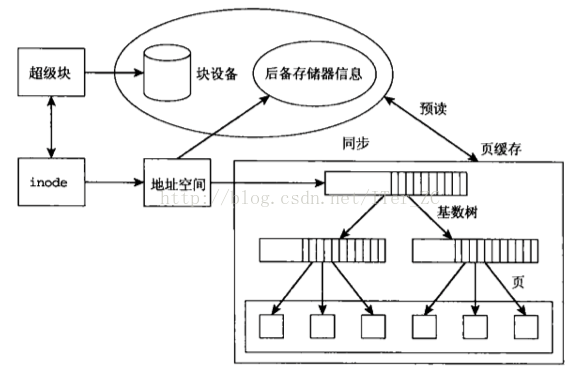

页缓存位于内存和文件之间缓冲区，文件IO操作实际上只和page cache交互，不直接和内存交互。

page cache通过一系列的数据结构，比如inode, address_space, struct page，实现将一个文件映射到页的级别：

1、struct page结构标志一个物理内存页，通过page + offset就可以将此页帧定位到一个文件中的具体位置。

2、文件系统的inode实际维护了这个文件所有的块block的块号，通过对文件偏移量offset取模可以定位到这个偏移量所在的文件系统的块号，磁盘的扇区号。
> 通过对文件偏移量offset进行取模可以计算出偏移量所在的页的偏移量。

3、page cache缓存组件抽象了地址空间address_space来作为文件系统和页缓存的中间桥梁。

4、页缓采用了一个基数树结构将一个文件的内容组织起来存放在物理内存struct page中。
> 一个文件inode对应一个地址空间address_space。一个address_space对应一个页缓存基数树。

**读磁盘**：内核会先检查 `Page Cache` 里是不是已经缓存了这个数据，如果是则直接从这个内存缓冲区里读取返回，如果不是则穿透到磁盘去读取，然后再缓存在 `Page Cache` 里，以备下次缓存命中；

**写磁盘**：内核直接把数据写入 `Page Cache`，并把对应的页标记为 dirty，添加到 dirty list 里，然后就直接返回，内核会定期把 dirty list 的页缓存 flush 到磁盘，保证页缓存和磁盘的最终一致性。
