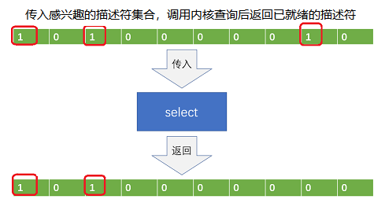
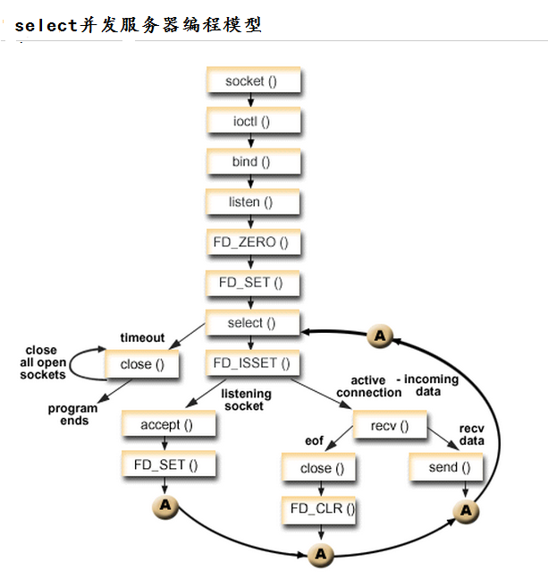
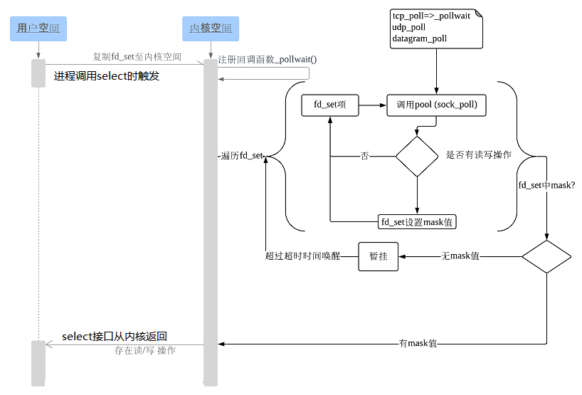
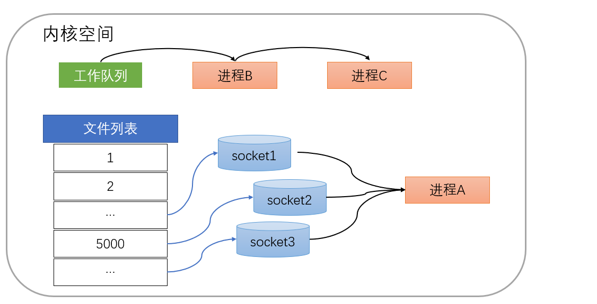
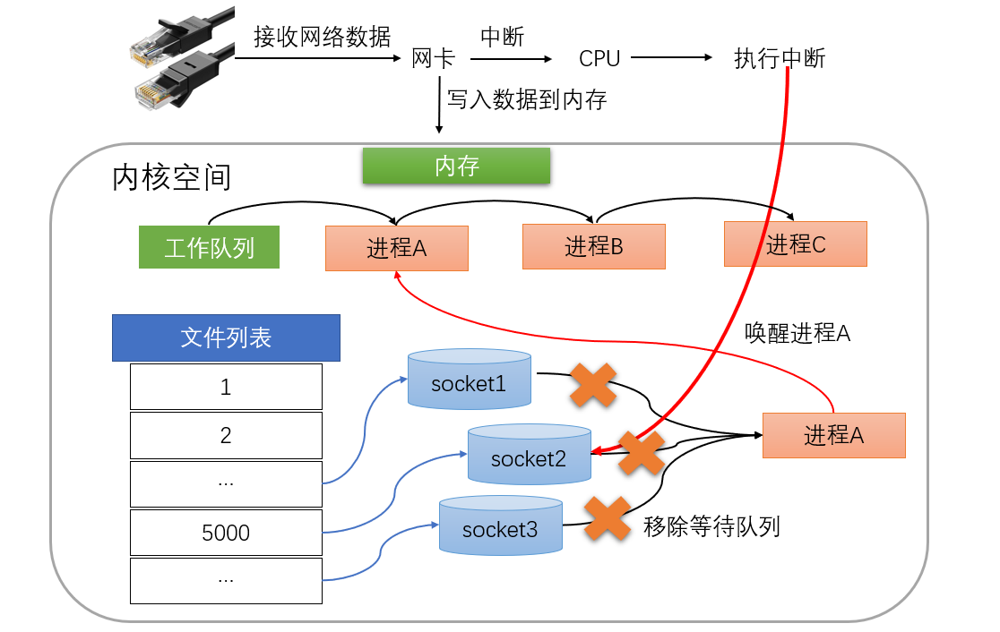

## select
select ：通过描述符集合来表示检测的I/O对象，通过三个不同的描述符集合来描述I/O事件 ：可读、可写和异常。
调用select函数后会被阻塞，直到有描述符就绪（可读、可写、或except），或者超时函数返回。然后遍历fdset，来找到就绪的描述符。 




函数签名如下：

```
int select(int nfds, 
		   fd_set *readfds,
           fd_set *writefds,
           fd_set *exceptfds,
           struct timeval *timeout);
```

参数说明：

- **nfds**， 一个整数值，是指集合中所有文件描述符的范围，即所有文件描述符的最大值加1。
- **readfds**，可读事件的 fd 集合。
- **writefds**，可写事件的 fd 集合。
- **exceptfds**，异常事件 fd 集合。
- **timeout**，允许等待的时间。 NULL 等待无限长的时间。0 表示立即返回， 0+ 表示等待具体的时长
- 返回：若有就绪描述符则为其数目，若超时则为0，若出错则为-1

[[fd_set]]



[[select_server]]


## 用户态进程与内核态进程交互



假设当进程A同时监视sock1、sock2和sock3则在调用select之后，操作系统把进程A分别加入这三个socket的等待队列中。当任何一个socket收到数据后，中断程序将唤起进程。



当sock2接收到了数据，中断程序唤起进程A。即将进程A从所有等待队列中移除，再加入到工作队列里面



经由这些步骤，当进程A被唤醒后，它知道至少有一个socket接收了数据。程序只需遍历一遍socket列表，就可以得到就绪的socket。


## 主要问题

其一，每次调用select都需要将进程加入到所有监视socket的等待队列，且每次唤醒都需要再从每个socket队列中移除。即每次都要将整个fd_set传递给内核，然后内核遍历所有的描述符，由于遍历的效率相对较低，因此设置单个进程所打开的文件描述符最多1024（32位）或2048（64位），查看命令：cat /proc/sys/fs/file-max。

其二，当进程被唤醒后需要再遍历一遍fd_set以检查已准备就绪的描述符。

