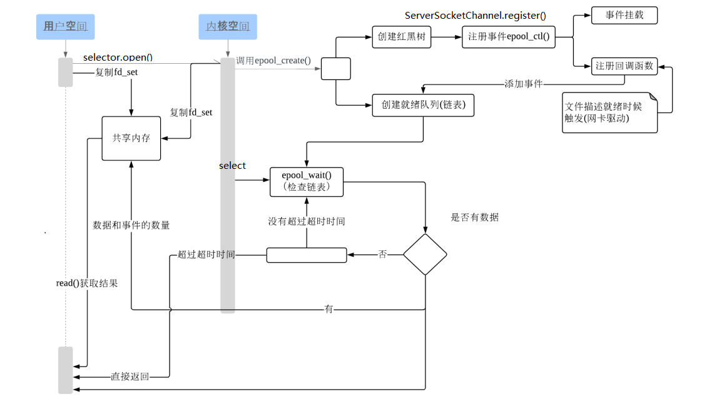
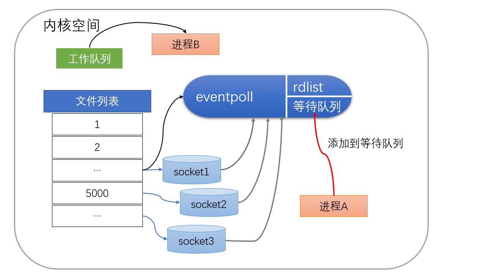
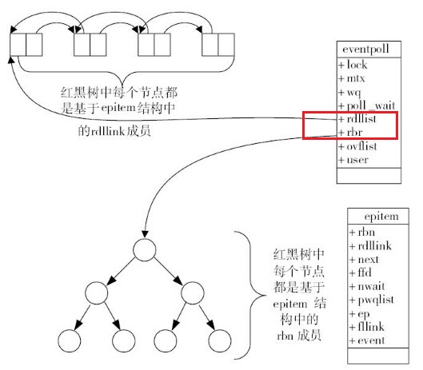

## **epoll的原理和流程**

> file_operations的poll是驱动提供给应用程序探测设备文件是否有数据可读接口。

### 创建event_poll 对象

当某个进程调用epoll_create方法时，内核会创建一个eventpoll对象。该对象会被保存到epoll_create()创建的匿名文件file的private_data字段中

首先，epoll_ctl函数通过epoll实例句柄来获得对应的匿名文件，然后通过private_data获取之前创建的eventpoll实例。

>  event_epoll对象创建后，调用epoll_ctl添加或删除所要监听的socket。

然后，epoll_ctl通过目标文件和对应描述字，在红黑树中查找是否存在该套接字。如果需要增加一个fd，则此时内核就会创建出一个epitem实例。然后调用ep_insert把这个实例作为红黑树的一个子节点，增加到eventpoll结构体中的红黑树的rbr字段中。

> eventpoll通过红黑树跟踪了当前监听的所有文件描述字，对于每个被监听的文件描述字，都有一个epitem类型的结点与之对应。
>
> ep_insert首先判断当前监控的文件值是否超过了/proc/sys/fs/epoll/max_user_watches的预设最大值

ep_insert会为加入的每个文件描述字通过ep_ptable_queue_proc设置回调函数 ep_poll_callback。 用于当对应的文件描述字有事件发生时回调，比如套接字缓冲区满了。
> ep_poll_callback 用于绑定内核中的事件和eventpoll。

### 检查就绪队列

1. epoll_wait 通过epoll实例找到对应的匿名文件和描述字，并且进行检查和验证。最终从对应匿名文件的private_data得到eventpoll实例。

2. 检查就绪队列（描述符列表）是否为空，

   如果为空则先阻塞当前进程，然后再把当前进程加入到eventpoll的等待队列wq中。当有事件发生时，通过ep_poll_callback函数可以把该等待进程唤醒。然后调用ep_poll来完成对应的事件收集并传递到用户空间。

   如果不为空则直接返回已就绪的文件描述列表

   

## epoll的实现细节

eventpoll包含了lock、mtx、wq（等待队列）、rdlist等成员。

**就绪列表**

就绪列表引用着就绪的socket，所以它应能够快速的插入数据。

程序可能随时调用epoll_ctl添加监视socket，也可能随时删除。当删除时，若该socket已经存放在就绪列表中，它也应该被移除。

所以就绪列表应是一种能够快速插入和删除的数据结构。双向链表就是这样一种数据结构，epoll使用双向链表来实现就绪队列（对应上图的rdllist）。

**监视队列**

既然epoll将“维护监视队列”和“进程阻塞”分离，也意味着需要有个数据结构来保存监视的socket。至少要方便的添加和移除，还要便于搜索，以避免重复添加。红黑树是一种自平衡二叉查找树，搜索、插入和删除时间复杂度都是O(log(N))，效率较好。epoll使用了红黑树作为索引结构（对应上图的rbr）。
