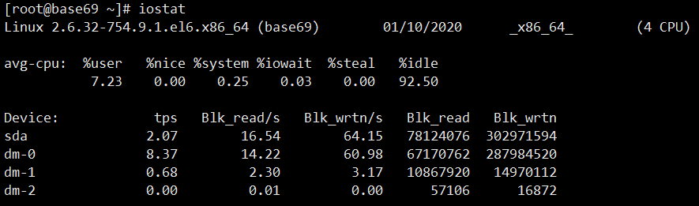

## iostat--收集中央处理器统计信息

iostat用于收集中央处理器（CPU）统计信息和整个系统. 适配器. tty 设备. 磁盘和 CD-ROM 的输入 / 输出统计信息。

tps: IOPS 每秒读写的次数，HDD 硬盘的 IOPS 通常也就在 100 左右。 PCI Express 接口的 SSD 硬盘，IOPS 也就是在 2 万左右。与CPU 的每秒 20 亿次操作的能力相差几个数量级。

Blk_read/s 和 Blk_wrtn/s 指标，就对应着数据传输率的指标。

通过实际硬盘读写的 tps、kB_read/s 和 kb_wrtn/s 的指标，我们基本上可以判断出，机器的性能是不是卡在 I/O 上。接下来可以通过iotop判断出具体的进程

显示扩展设备信息

| -              | -                                                            |
| -------------- | ------------------------------------------------------------ |
| rrqm/s和wrqm/s | 每秒合并的读和写请求，“合并的”意味着操作系统从队列中拿出多个逻辑请求合并为一个请求到实际磁盘。 |
| r/s和w/s       | 每秒发送到设备的读和写请求数。                               |
| rsec/s和wsec/s | 每秒读和写的扇区数。                                         |
| avgrq –sz      | 请求的扇区数。                                               |
| avgqu –sz      | 在设备队列中等待的请求数。                                   |
| await          | 每个IO请求花费的时间。                                       |
| svctm          | 实际请求（服务）时间。                                       |
| %util          | 至少有一个活跃请求所占时间的百分比。                         |

