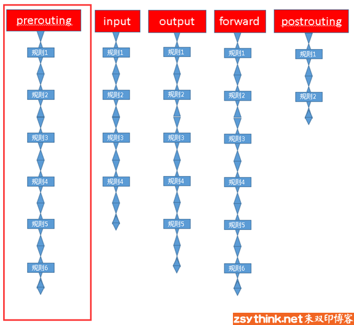

iptables 管理

Iptables 本身并非真正的防火墙。Iptables 与 netfilter 的关系类似于navicat与mysql数据库的关系。Netfilter是防火墙真正的安全框架，iptables是一个命令行工具，位于用户空间。Netfilter/iptables共同组成linux平台下的包过滤防火墙。Netfilter为linux核心层中的数据包处理模块，具有网络地址转换、数据包内容修改、以及数据包过滤的防火墙功能。Iptable 总共包含5个链，prerouting链、 input 链、output链、forward链（转发需要开启内核的IP_FORWARD功能）postrouting链，报文请求过程如下:

- 到本机某进程的报文：prerouting -\> input

- 由本机转发的报文： prerouting -\> forward -\> postrouting

- 由本机的某进程发出报文（通常为响应报文） out -\> postrouting


链条其实就是多个规则按顺序组成的集合，如下



表指的相同类型规则的集合。在同一个表中可以具有相同功能链条的具体内容。Iptables提供了4种类型的规则，也就是说提供了4张表。

Filter表，负责过滤功能、防火墙。Nat表，网络地质转换功能。Mangle表，拆解报文，做出修改。Raw 表，关闭nat表上启用的连接追踪机制。并非所有表中的规则都能被所有的链条使用，下图是表与链条的对应关系，如下：


数据包经过防火墙的流程，如下：


规则由匹配条件和处理动作组成。匹配规则可以区分为基本匹配条件和扩展匹配条件。基本匹配条件包括SourceIP 和 DestinationIP，扩展匹配条件（需要依赖对应的扩展模块）包括 SourcePort 和 DestinationPort 。处理动作（target） 主要有 ACCPET 通过，DROP 丢弃，REJECT拒绝，SNAT 源地址转换，DNAT 目标地址转换，REDIRECT 在本机作端口映射，LOG 记录日志。

**DNAT、SNAT概念**

SNAT是source network address translation的缩写，即源地址转换。比如，多台PC通过连接陆游路由器上网，每台PC都配置了内网IP。当PC访问外部网络的时候，路由器将数据包的报头中的源地址替换成路由器的ip的过程叫源地址转换。

DNAT是destination network address translation的缩写，即目标网络地址转换。典型的应用是，有个web服务器放在内网配置内网ip，前端有个防火墙配置公网ip。互联网上的访问者使用公网ip来访问，客户端发出一个数据包，且报头中的目标地址写成是防火墙的公网ip。当防火墙接收到请求时，会把此数据包的报头改写成web服务器的内网ip。然后再把这个数据包发送到内网的web服务器上，这个过程就叫网络地址转换。

Iptables 操作说明

查询规则：

```
Iptables -t filter -vL // 查看对应表（filter）的所有规则
Iptables -t filter -vL INPUT // 查看对应表(filter) 的 指定链（INPUT）中的规则
Iptables -t filter -nvL //查看表（filter）的所有规则，并在显示规则时不对规则中的IP或者端口进行反解
Iptables -t filter --line -nvL // 查看表filter中所有规则并且显示规则序号
```


添加规则

```
在链条后追加规则：iptables -t 表名 -A 链名 匹配条件 -j 动作。iptables -t filter -A INPUT -s 192.168.1.146 -j DROP
在链条首部插入规则：iptables -t 表名 -I 链名 匹配条件 -j 动作。iptables -t filter -I INPUT -s 192.168.1.146 -j ACCEPT
在链条指定位置插入规则：iptables -t 表名 -I 链名 规则序号 匹配条件 -j 动作。iptables -t filter -I INPUT 5 -s 192.168.1.146 -j REJECT
设定表的指定链条的默认规则：iptables -t 表名 -P 链名 动作。iptables -t filter -P FORWARD ACCEPT
```


删除规则

```
删除链条第几号的规则：iptables -t 表名 -D 链名 规则序号。iptables -t filter -D INPUT 3
删除指定链的指定规则：iptables -t 表名 -D 链名 匹配条件 -j 动作。iptables -t filter -D INPUT -s 192.168.1.146 -j DROP
删除指定链的所哟u规则：iptables -t 表名 -F 链名。iptables -t filter -F INPUT
```


保存规则

```
service iptables save
```

