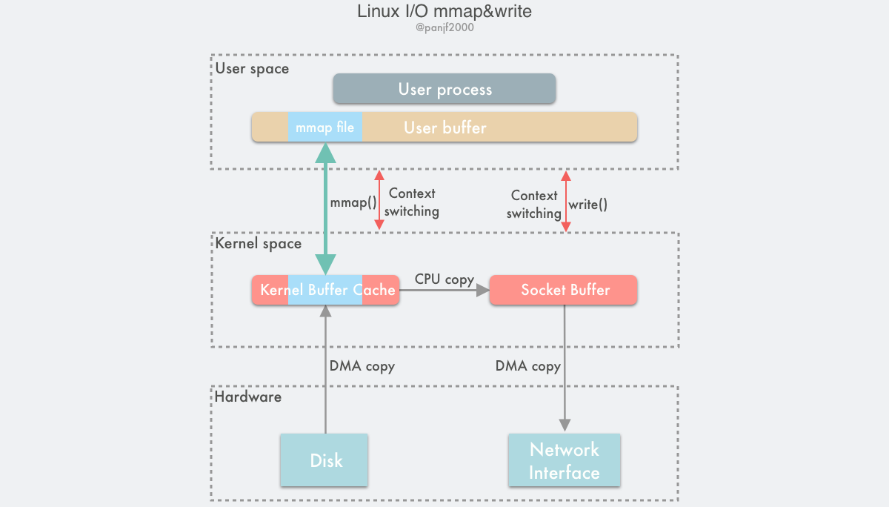

## mmap()

```c
#include <sys/mman.h>

void *mmap(void *addr, size_t length, int prot, int flags, int fd, off_t offset);
int munmap(void *addr, size_t length);
```

`mmap()` 也即是内存映射（memory map）：把用户进程空间的一段内存缓冲区（user buffer）映射到文件所在的内核缓冲区（kernel buffer）上。



利用 `mmap()` 替换 `read()`，配合 `write()` 调用的整个流程如下：

1. 用户进程调用 `mmap()`，从用户态陷入内核态，将内核缓冲区映射到用户缓存区；
2. DMA 控制器将数据从硬盘拷贝到内核缓冲区；
3. `mmap()` 返回，上下文从内核态切换回用户态；
4. 用户进程调用 `write()`，尝试把文件数据写到内核里的套接字缓冲区，再次陷入内核态；
5. CPU 将内核缓冲区中的数据拷贝到的套接字缓冲区；
6. DMA 控制器将数据从套接字缓冲区拷贝到网卡完成数据传输；
7. `write()` 返回，上下文从内核态切换回用户态。


优点：

一是节省内存空间，因为用户进程上的这一段内存是虚拟的，并不真正占据物理内存，只是映射到文件所在的内核缓冲区上，因此可以节省一半的内存占用；

二是省去了一次 CPU 拷贝，对比传统的 Linux I/O 读写，数据不需要再经过用户进程进行转发了，而是直接在内核里就完成了拷贝。

缺点：

首先是因为数据数据传输过程中依然需要一次 CPU 拷贝，

其次是内存映射技术是一个开销很大的虚拟存储操作：这种操作需要修改页表以及用内核缓冲区里的文件数据汰换掉当前 TLB 里的缓存以维持虚拟内存映射的一致性。
