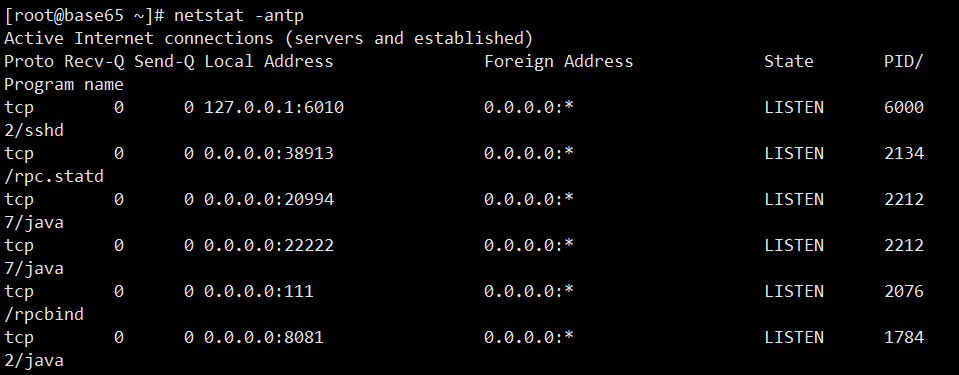
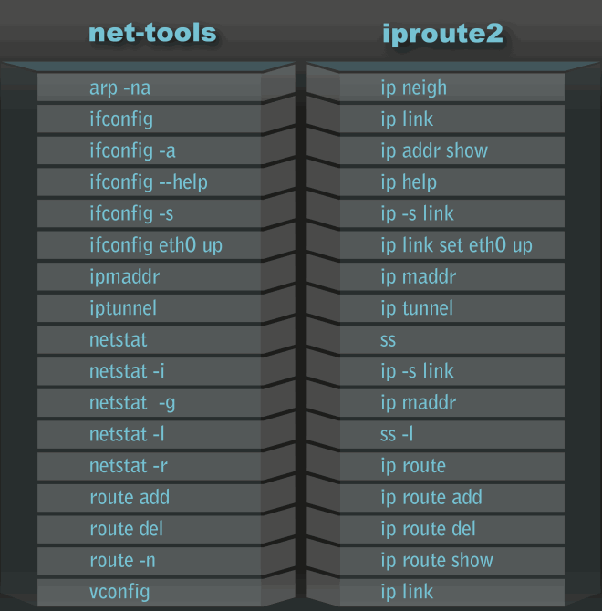

## netstat - 查看网络协议使用端口和服务



| 命令          | 解释                           |
| ------------- | ------------------------------ |
| netstat -a    | # 列出所有端口                 |
| netstat -at   | # 列出所有TCP端口              |
| netstat -au   | # 列出所有UDP端口              |
| netstat -l    | # 只显示监听端口               |
| netstat -lt   | # 显示监听TCP端口              |
| netstat -lu   | # 显示监听UDP端口              |
| netstat -s    | # 显示所有端口的统计信息       |
| netstat -st   | # 显示所有TCP的统计信息        |
| netstat --r   | # 显示核心路由信息             |
| netstat -rn   | # 显示数字格式，不查询主机名称 |
| netstat -antp | # 查看端口和服务               |

> netstat -anltp | grep port 或 lsof -i :port 查看端口号对应的应用Id
> ps -ef | grep pid 获取对应的应用
   lsof /var/run/docker.sock 查看占用文件docker.sock对应的进程



抓的包是TCP，且端口是80，包来自IP地址为192.168.1.25的主机地址。
```
tcpdump 'tcp and port 80 and src host 192.168.1.25' 
```

tcpdump在开启抓包的时候，会自动创建一个类型为AF\_PACKET的网络套接口，并向系统内核注册。系统内核接下来就会将网卡收到的报文发送给该协议的回调函数进行一次处理，然后交给tcpdump