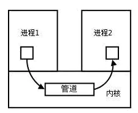
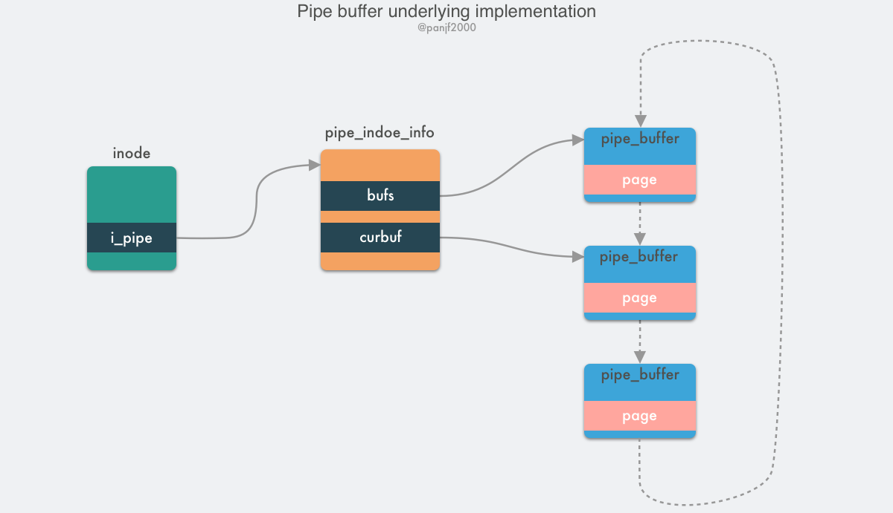

## 管道/匿名管道(pipe)

管道是Linux 支持的最初Unix IPC形式之一，具有以下特点：

1. 管道是**半双工的**，数据只能向一个方向流动；**需要双方通信时，需要建立起两个管道**；

2. 匿名管道只能用于父子进程或者兄弟进程之间（具有亲缘关系的进程）；[[fork]]

3. 单独构成一种独立的文件系统：管道对于管道两端的进程而言，就是一个文件但不受文件系统管理，且只存在与内存中。

管道分为pipe（无名管道）和`fifo`（命名管道）两种，除了建立、打开、删除的方式不同外，这两种管道几乎是一样的。他们都是通过内核缓冲区实现数据传输。

- pipe用于相关进程之间的通信，例如父进程和子进程，它通过pipe()系统调用来创建并打开，当最后一个使用它的进程关闭对他的引用时，pipe将自动撤销。
- FIFO即命名管道，**在磁盘上有对应的节点，但没有数据块**——换言之，只是拥有一个名字和相应的访问权限，通过mknode()系统调用或者mkfifo()函数来建立的。一旦建立，任何有访问权限的进程都可以通过文件名将其打开和进行读写，而不局限于父子进程。当不再被进程使用时，FIFO在内存中释放，但磁盘节点仍然存在。

管道的实质是一个内核缓冲区，进程以先进先出的方式从缓冲区存取数据：管道一端的进程顺序地将进程数据写入缓冲区，另一端的进程则顺序地读取数据。该缓冲区可以看做一个循环队列，读和写的位置都是自动增加的，一个数据只能被读一次，读出以后再缓冲区都不复存在了。

用户进程可以通过 `pipe()` 系统调用创建一个匿名管道，创建完成之后会有两个 file 结构体的 inode 分别指向其写入端和读出端，并返回对应的两个文件描述符。

**匿名管道和有名管道总结：**

  1. 管道是特殊类型的文件，在满足先入先出的原则条件下可以进行读写，但不能进行定位读写。
  2. 匿名管道是单向的，只能在有亲缘关系的进程间通信；有名管道以磁盘文件的方式存在，可以实现本机任意两个进程通信。
  3. **无名管道阻塞问题：**无名管道无需显示打开，创建时直接返回文件描述符，在读写时需要确定对方的存在，否则将退出。如果当前进程向无名管道的一端写数据，必须确定另一端有某一进程。如果写入无名管道的数据超过其最大值，写操作将阻塞，如果管道中没有数据，读操作将阻塞，如果管道发现另一端断开，将自动退出。
  4. **有名管道阻塞问题：**有名管道在打开时需要确实对方的存在，否则将阻塞。即以读方式打开某管道，在此之前必须一个进程以写方式打开管道，否则阻塞。此外，可以以读写（O_RDWR）模式打开有名管道，即当前进程读，当前进程写，不会阻塞。

 

