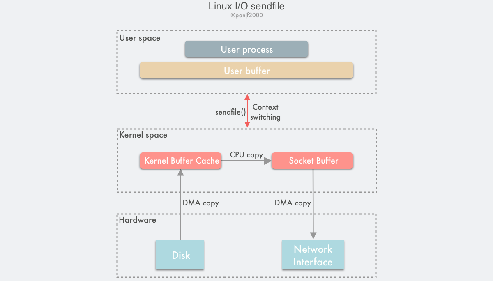
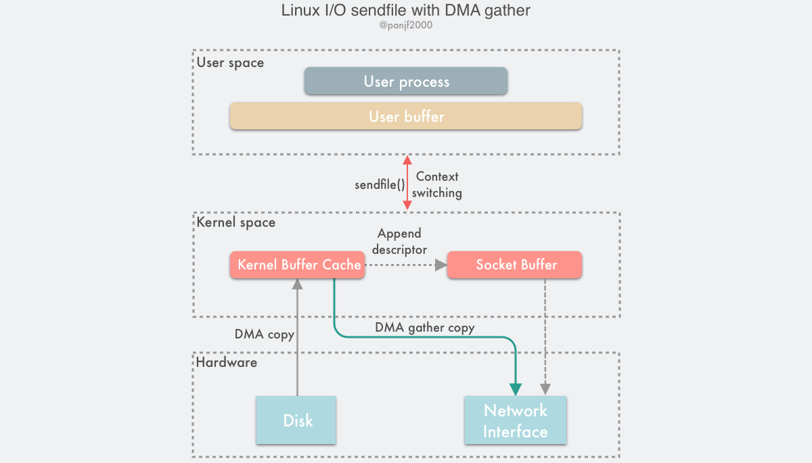

### sendfile()

在 Linux 内核 2.1 版本中，引入了一个新的系统调用 `sendfile()`，从功能上来看，这个系统调用将 `mmap()` + `write()` 这两个系统调用合二为一。

```c
#include <sys/sendfile.h>

ssize_t sendfile(int out_fd, int in_fd, off_t *offset, size_t count);
```

out_fd 和 in_fd 分别代表了写入和读出的文件描述符，in_fd 必须是一个指向文件的文件描述符，且要能支持类 `mmap()` 内存映射，不能是 Socket 类型，而 out_fd 可以是任意类型的文件描述符。

off_t 是一个代表了 in_fd 偏移量的指针，指示 `sendfile()` 该从 in_fd 的哪个位置开始读取，

count 参数则是此次调用需要传输的字节总数。



使用 `sendfile()` 完成一次数据读写的流程如下：

1. 用户进程调用 `sendfile()` 从用户态陷入内核态；
2. DMA 控制器将数据从硬盘拷贝到内核缓冲区；
3. CPU 将内核缓冲区中的数据拷贝到套接字缓冲区；
4. DMA 控制器将数据从套接字缓冲区拷贝到网卡完成数据传输；
5. `sendfile()` 返回，上下文从内核态切换回用户态。


## sendfile() with DMA Scatter/Gather Copy

scatter 使得 DMA 拷贝可以不再需要把数据存储在一片连续的内存空间上，而是允许离散存储，

gather 则能够让 DMA 控制器根据内存地址和数据大小的缓冲区描述符等信息收集存储在各处的数据，然后直接拷贝到网卡而非套接字缓冲区。



`sendfile() + DMA gather` 的数据传输过程如下：

1. 用户进程调用 `sendfile()`，从用户态陷入内核态；
2. DMA 控制器使用 scatter 功能把数据从硬盘拷贝到内核缓冲区进行离散存储；
3. CPU 把包含内存地址和数据长度的缓冲区描述符拷贝到套接字缓冲区
4. DMA 控制器根据缓冲区描述符里的内存地址和数据大小，使用 gather 功能从内核缓冲区收集离散的数据并组包，最后直接把网络包数据拷贝到网卡完成数据传输；
5. `sendfile()` 返回，上下文从内核态切换回用户态。

缺点：需要新硬件支持，输入文件描述符依然只能指向文件，且需要一次CPU参与数据拷贝
