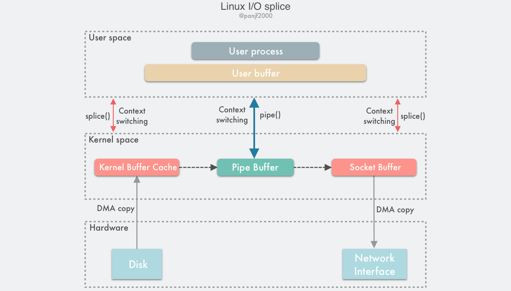

## splice()

Linux 在 2.6.17 版本引入了一个新的系统调用 `splice()`，在底层实现上等同于 `sendfile()` + DMA Scatter/Gather，且完全去除了数据传输过程中的 CPU 拷贝。

`splice()` 系统调用函数定义如下：

```c
#include <fcntl.h>
#include <unistd.h>

int pipe(int pipefd[2]);
int pipe2(int pipefd[2], int flags);

ssize_t splice(int fd_in, loff_t *off_in, int fd_out, loff_t *off_out, size_t len, unsigned int flags);
```

fd_in 和 fd_out 也是分别代表了输入端和输出端的文件描述符，

off_in 和 off_out 则分别是 fd_in 和 fd_out 的偏移量指针，指示内核从哪里读取和写入数据，

len 则指示了此次调用希望传输的字节数，

flags 是用来设置系统调用的行为属性的。


`splice()` 是基于 Linux 的管道缓冲区 (pipe buffer) 机制实现的，所以 `splice()` 的两个入参文件描述符才要求必须有一个是管道设备：

```c
int pfd[2];

pipe(pfd);

ssize_t bytes = splice(file_fd, NULL, pfd[1], NULL, 4096, SPLICE_F_MOVE);
assert(bytes != -1);

bytes = splice(pfd[0], NULL, socket_fd, NULL, bytes, SPLICE_F_MOVE | SPLICE_F_MORE);
assert(bytes != -1);
```

数据传输过程图：



使用 `splice()` 完成一次磁盘文件到网卡的读写过程如下：

1. 用户进程调用 `pipe()`，从用户态陷入内核态，创建匿名单向管道，`pipe()` 返回，上下文从内核态切换回用户态；
2. 用户进程调用 `splice()`，从用户态陷入内核态；
3. DMA 控制器将数据从硬盘拷贝到内核缓冲区，从管道的写入端"拷贝"进管道，`splice()` 返回，上下文从内核态回到用户态；
4. 用户进程再次调用 `splice()`，从用户态陷入内核态；
5. 内核把数据从管道的读取端"拷贝"到套接字缓冲区，DMA 控制器将数据从套接字缓冲区拷贝到网卡；
6. `splice()` 返回，上下文从内核态切换回用户态。


`splice()` 在通过管道传输数据的时候通过零拷贝方式实现，因为在写入读出时通过把数据在内存缓冲区中的物理内存页框指针、偏移量和长度赋值给 `pipe_buffer` 来完成数据的"拷贝"，也就是其实只拷贝了数据的内存地址等元信息。