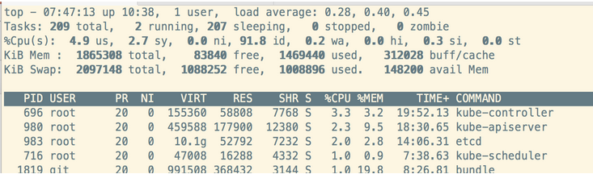

## top - 查看系统进程使用资源情况

load average： CPU的平均负载值，示例中的load average: 0.00, 0.03, 0.00分别表示当前CPU在1分钟. 5分钟和15分钟内的平均负载。

>统计数据由内核会统计出并写入到文件/proc/loadavg。
>统计的规则：单位时间内处于运行状态以及等待磁盘 I/O状态的平均job数量。建议：平均负载 < 0.7 * CPU核数

top之%Cpu(s): 统计CPU处于不同状态的时间。

>CPU 状态包括：空闲，用户态，内核态
>
>1. Idle： 处于空闲状态，没有任务需要调度
>2. User space： 正在运行user space的代码（处于用户态）
>3. Kernel： 正在运行内核的代码（处于内核态）

1. 2.5 us ： CPU有2.5%的时间在运行用户态代码

2. 1.8 sy ： CPU有1.8%的时间在运行内核态代码。 %sy高说明内核占用太多资源或者用户进程发起了太多的系统调用。

3. 3.1 ni ： CPU有3.1%的时间在运行niceness不为0的进程代码。

4. 90.5 id ： CPU有90.5%的时间处于空闲状态

5. 1.7 wa ： 代表着 iowait，也就是 CPU 等待 IO 完成操作花费的时间占 CPU 的百分比。CPU有1.7%的时间处于I/O等待状态。

   > 如果wa偏大则需要查看实际硬盘的读写情况，使用命令iostat

6. 0.0 hi & 0.4 si ：　这两个值反映了CPU有多少时间花在了中断处理上，hi（hardware interrupts）是硬件中断，si(softirqs
   是软件中断。

7. 0.0 st　：当系统运行在虚拟机中时，当前虚拟机就会和宿主机以及其它的虚拟机共享CPU，%st表示当前虚拟机在等待CPU为它服务的时间。