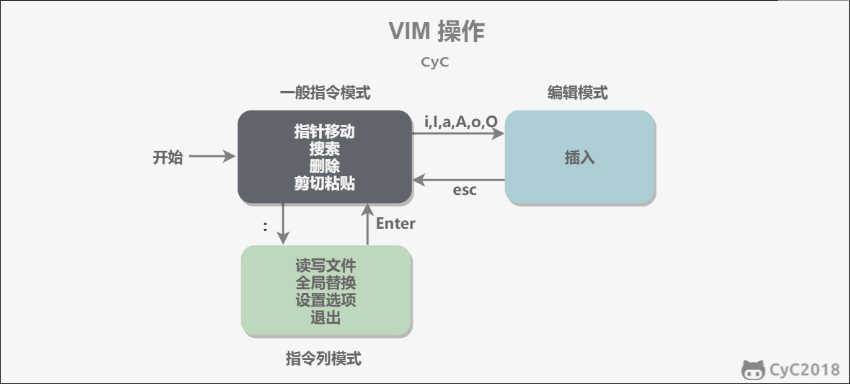

## VIM 三个模式

- 一般指令模式（Command mode）：VIM 的默认模式，可以用于移动游标查看内容；
- 编辑模式（Insert mode）：按下 "i" 等按键之后进入，可以对文本进行编辑；
- 指令列模式（Bottom-line mode）：按下 ":" 按键之后进入，用于保存退出等操作。

在指令列模式下，有以下命令用于离开或者保存文件。

| 命令 | 作用 |
| :--: | :--: |
| :w | 写入磁盘|
| :w! | 当文件为只读时，强制写入磁盘。到底能不能写入，与用户对该文件的权限有关 |
| :q | 离开 |
| :q! | 强制离开不保存 |
| :wq | 写入磁盘后离开 |
| :wq!| 强制写入磁盘后离开 |

- http://www.ruanyifeng.com/blog/2011/05/how_to_choose_free_software_licenses.html)