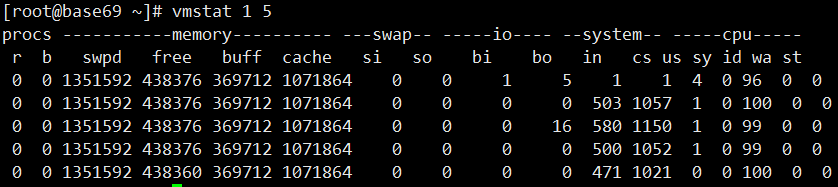

## vmstat--虚拟内存统计

Virtual Meomory Statistics 虚拟内存统计，可以监控虚拟内存. 进程. CPU等。用法：vmstat interval times，比如：vmstat 1 5 动态显示，每一秒显示一次，显示5次结束

Procs（进程）

| -    | -                                                            |
| ---- | ------------------------------------------------------------ |
| r    | 表示运行或者等待cpu时间片的进程数量。该数值越大，通常表示系统运行越慢 |
| b    | 等待IO的进程数量。                                           |

Memory（内存）

| -     | -                                                            |
| ----- | ------------------------------------------------------------ |
| swpd  | 使用虚拟内存大小                                             |
| free  | 空闲物理内存大小。                                           |
| buff  | 用作缓冲的内存大小。用于存储速度不同步的设备或优先级不同的设备之间传输数据 |
| cache | 用作高速缓存的内存大小，位于CPU和主内存之间的容量较小但速度很快的存储器 |

Swap

| -    | -                                                      |
| ---- | ------------------------------------------------------ |
| si   | 表示有多少kb的数据从swap进入到内存中，单位kb。         |
| so   | 表示有多少kb的数据从内存写入到交换分区swap中，单位kb。 |

IO

| -    | -              |
| ---- | -------------- |
| bi   | 每秒读取的块数 |
| bo   | 每秒写入的块数 |

system（系统）

| -    | -                          |
| ---- | -------------------------- |
| in   | 每秒中断数，包括时钟中断。 |
| cs   | 每秒上下文切换数。         |

CPU（以百分比表示）

| -    | -                                       |
| ---- | --------------------------------------- |
| us   | 用户进程执行时间百分比(user time) us    |
| sy   | 内核系统进程执行时间百分比(system time) |
| wa   | IO等待时间百分比                        |
| id   | 空闲时间百分比                          |

