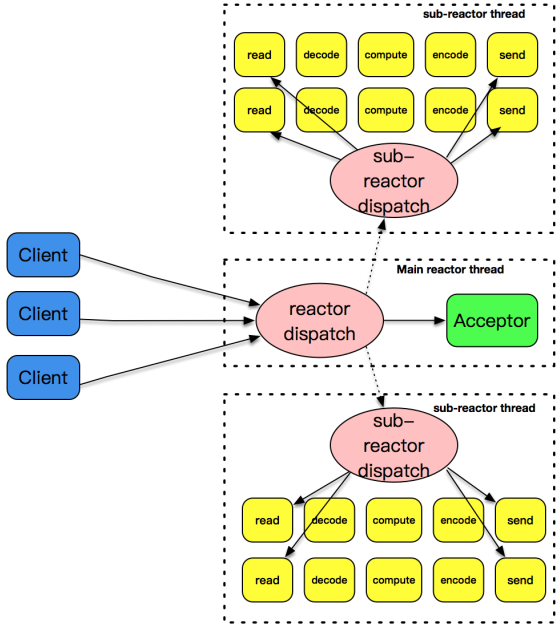
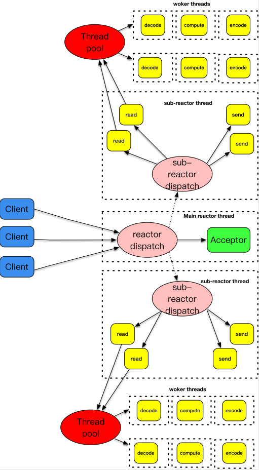

### 主从Reactor模式

主-从Reactor模式的核心思想是，主反应堆线程只负责分发Acceptor连接建立，已连接套接字上的I/O事件交给sub-reactor负责分发。其中sub-reactor的数量，可以根据CPU的核数来灵活设置（充分使用CPU资源）。

主反应堆线程唯一的工作，就是调用accept获取已连接套接字，以及将已连接套接字加入到从反应堆线程中。

主-从reactor+worker threads模式： 将业务工作放置到另外的线程池中，和反应堆线程解耦

[[Netty]]