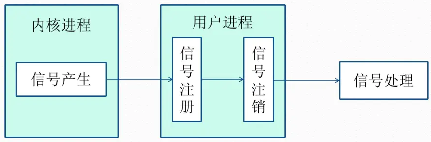

## 信号(Signal)

- 信号是Linux系统中用于进程间互相通信或者操作的一种机制，信号可以在任何时候发给某一进程，而无需知道该进程的状态。
- 如果该进程当前并未处于执行状态，则该信号就有内核保存起来，知道该进程回复执行并传递给它为止。
- 如果一个信号被进程设置为阻塞，则该信号的传递被延迟，直到其阻塞被取消是才被传递给进程。

> **Linux系统中常用信号：**
>
>   1. **SIGHUP：**用户从终端注销，所有已启动进程都将收到该进程。系统缺省状态下对该信号的处理是终止进程。
>   2. **SIGINT：**程序终止信号。程序运行过程中，按`Ctrl+C`键将产生该信号。
>   3. **SIGQUIT：**`ctrl+\`键将产生该信号。
>   4. **SIGBUS和SIGSEGV：**进程访问非法地址。
>   5. **SIGFPE：**运算中出现致命错误，如除零操作、数据溢出等。
>   6. **SIGKILL：**用户终止进程执行信号。shell下执行`kill -9`发送该信号。
>   7. **SIGTERM：**结束进程信号。shell下执行`kill 进程pid`发送该信号。
>   8. **SIGALRM：**定时器信号。
>   9. **SIGCLD：**子进程退出信号。如果其父进程没有忽略该信号也没有处理该信号，则子进程退出后将形成僵尸进程。
>   10. **SIGTSTP**：用户按下挂起键(`ctrl+z`)，系统发送此信号，造成进程挂起。

**信号来源**
信号是软件层次上对中断机制的一种模拟，是一种异步通信方式，信号可以在用户空间进程和内核之间直接交互，内核可以利用信号来通知用户空间的进程发生了哪些系统事件，信号事件主要有两个来源：

- 硬件来源：用户按键输入`Ctrl+C`退出、硬件异常如无效的存储访问等。
- 软件终止：终止进程信号、其他进程调用kill函数、软件异常产生信号。

**信号生命周期和处理流程**

  1. 信号被某个进程产生，并设置此信号传递的对象（一般为对应进程的`pid`），然后传递给操作系统；
  2. 操作系统根据接收进程的设置（是否阻塞）而选择性的发送给接收者，如果接收者阻塞该信号（且该信号是可以阻塞的），操作系统将暂时保留该信号，而不传递，直到该进程解除了对此信号的阻塞（如果对应进程已经退出，则丢弃此信号），如果对应进程没有阻塞，操作系统将传递此信号。
  3. 目的进程接收到此信号后，将根据当前进程对此信号设置的预处理方式，暂时终止当前代码的执行，保护上下文（主要包括临时寄存器数据，当前程序位置以及当前CPU的状态）、转而执行中断服务程序，执行完成后在回复到中断的位置。当然，对于抢占式内核，在中断返回时还将引发新的调度。

