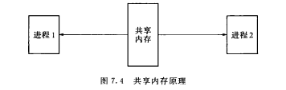
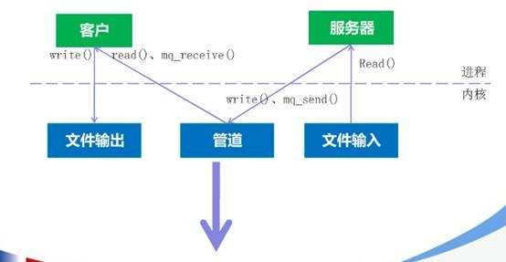

## 共享内存(share memory)

共享内存允许两个或多个进程共享一个给定的存储区，这一段存储区可以被两个或两个以上的进程映射至自身的地址空间中，一个进程写入共享内存的信息，可以被其他使用这个共享内存的进程，通过一个简单的内存读取错做读出，从而实现了进程间的通信。

采用共享内存进行通信的一个主要好处是效率高，因为进程可以直接读写内存，而不需要任何数据的拷贝，对于像管道和消息队里等通信方式，**则需要再内核和用户空间进行四次的数据拷贝，而共享内存则只拷贝两次：一次从输入文件到共享内存区，另一次从共享内存到输出文件。**

一般而言，进程之间在共享内存时，并不总是读写少量数据后就解除映射，有新的通信时在重新建立共享内存区域；而是保持共享区域，直到通信完毕为止，这样，数据内容一直保存在共享内存中，并没有写回文件。共享内存中的内容往往是在解除映射时才写回文件，因此，采用共享内存的通信方式效率非常高。

**内存映射**：memory map机制使进程之间通过映射同一个普通文件实现共享内存，通过mmap()系统调用实现。普通文件被映射到进程地址空间后，进程可以像访问普通内存一样对文件进行访问，不必再调用read/write等文件操作函数。

**UNIX System V共享内存机制**：IPC的共享内存指的是把所有的共享数据放在共享内存区域（IPC shared memory region），任何想要访问该数据的进程都必须在本进程的地址空间新增一块内存区域，用来映射存放共享数据的物理内存页面。

> `mmap`系统调用通过映射一个普通文件实现共享内存。
>
> `UNIX system V`共享内存是通过映射特殊文件系统`shm`中的文件实现进程间的共享内存。
