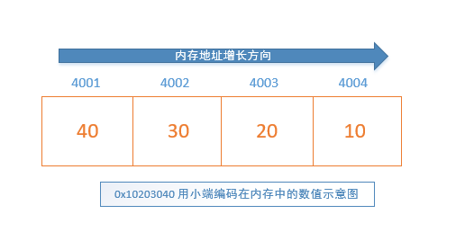
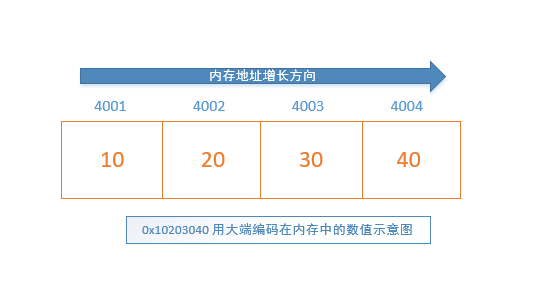

## 主机字节序

**字节序**指的是对于存储需要多个字节（大于 1 字节）的整数来说，其每个字节在不同的机器内存中存储的顺序。一般分为两类：

- **little-endian** (LE，俗称**小端编码**或**小头编码**)

  对于一个整数值，如果使用小端字节序，整数的**高**位存储在内存地址**高**的位置，整数的**低**位存储在内存地址**低**的位置上（所谓的**高高低低**）。Intel x86 系列的系统使用的是小端编码方式。

- **big-endian**（BE，俗称**大端编码**或**大头编码**）

  对于一个整数值，如果使用大端字节序，整数的**高**位存储在内存地址**低**的位置，整数的**低**位存储在内存地址**高**的位置上（所谓的**高低低高**）。Java 程序、Mac 机器上的程序一般是大端编码方式。

举个例子，对于内存中双字值 **0x10203040** （4 字节）的存储方式，如果使用**小端编码**，其内存中存储方式如下：



如果使用**大端编码** 来存储 **0x10203040**，在内存中存储示意图如下：




## 网络字节序

**网络字节序**是 TCP/IP 协议中规定好的一种数据表示格式，与具体的 CPU 类型、操作系统等无关，网络字节顺序采用 **big-endian** 排序方式。因此为了不同的机器和系统可以正常交换数据建议将需要传输的整型值转换成网络字节序：

```c
//2.初始化服务器地址
struct sockaddr_in bindaddr;
bindaddr.sin_family = AF_INET;
bindaddr.sin_addr.s_addr = htonl(INADDR_ANY);
//将端口号3000转换成网络字节序
bindaddr.sin_port = htons(3000);
if (bind(listenfd, (struct sockaddr *)&bindaddr, sizeof(bindaddr)) == -1)
{
    std::cout << "bind listen socket error." << std::endl;
    return -1;
}
```

