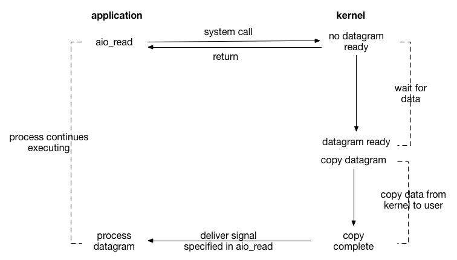

## 异步IO（Asynchronous IO）

用户进程发起read操作之后，就可以开始去做其它的事。
当内核收到一个asynchronous read之后，
首先它会立刻返回，所以不会对用户进程产生任何block。然后，kernel会等待数据准备完成。
然后将数据拷贝到用户内存，当这一切都完成之后，kernel会给用户进程发送一个signal，告诉它read操作完成了。

与信号驱动式I/O模型的区别

  信号驱动式I/O是由内核告诉我们何时可以启动一个I/O操作，而异步I/O模型则是由内核通知我们I/O操作何时完成。