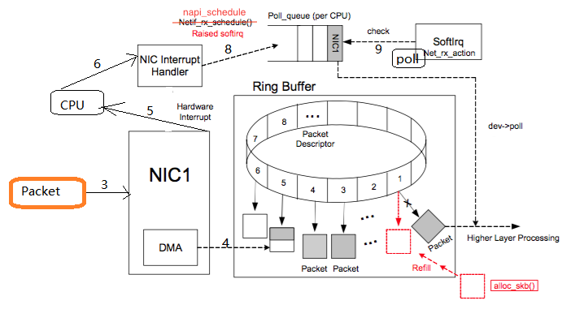
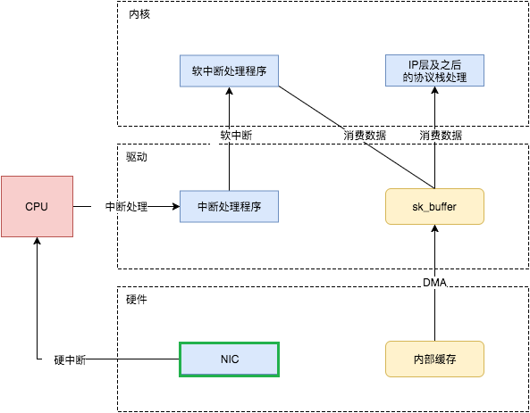
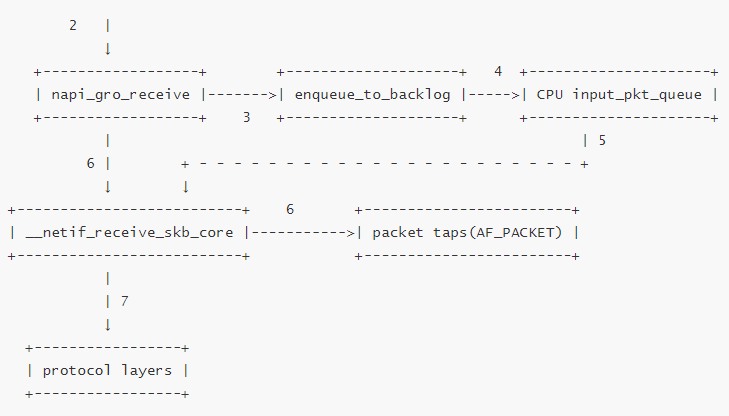
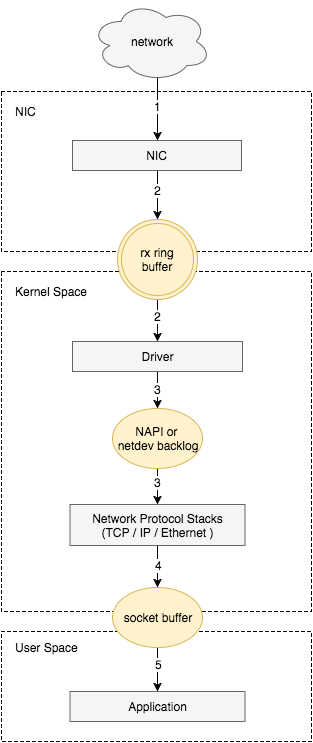
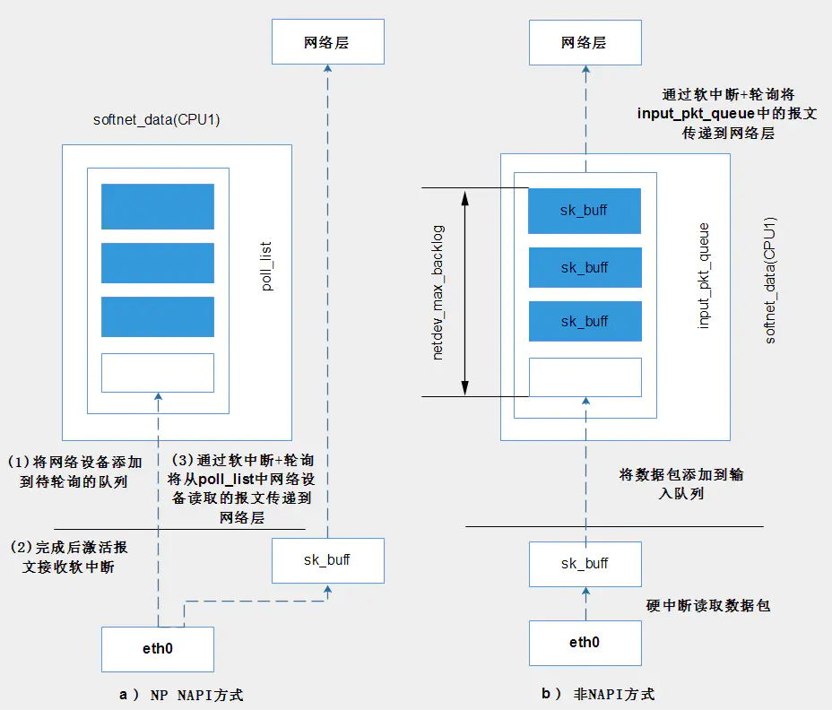

## 网卡到内核

网卡的驱动，负责衔接网卡和内核的网络模块，驱动在加载到内核的时将自己注册进网络模块。因此当网卡收到数据包时，网络模块会调用相应的驱动程序处理数据。

1. 驱动在内存中分配一片缓冲区用来接收数据包，叫做 `sk_buff`；

2. 将上述缓冲区的地址和大小（即接收描述符），加入到 `Ring buffer`。驱动通知网卡有一个新的描述符，网卡从 `Ring Buffer` 中取出描述符，从而获知缓冲区的地址和大小；

   > Ring Buffer :NIC(network interface card) 和驱动程序共享的一片区域

3. 数据包从外面的网络进入物理网卡。如果目的地址不是该网卡，且该网卡出游非混杂模式时，该包会被网卡丢弃。

4. DMA 将 NIC 接收的数据包逐个写入 sk_buff ，一个数据包可能占用多个 sk_buff 。

   > 当驱动处理速度跟不上网卡收包速度时，驱动来不及分配缓冲区，NIC 接收到的数据包无法及时写到 `sk_buff`，就会产生堆积，当 NIC 内部缓冲区写满后，就会丢弃部分数据，引起丢包。这部分丢包为 `rx_fifo_errors`，在 `/proc/net/dev` 中体现为 fifo 字段增长，在 ifconfig 中体现为 overruns 指标增长。

5. DMA 读完数据之后，==NIC立即发起硬中断通知CPU开始处理数据==。然后禁用网卡的硬中断，避免CPU不停的被中断以提高效率。

   > 通过DMA的方式将数据写入到内存中后，需要硬中断通知内核有数据。

6. NIC 会通过 NIC Interrupt Handler 触发 IRQ （软中断请求）。调用 NIC driver 注册的硬中断处理函数

> 现在的内核及驱动都采用一种叫 NAPI（new API）的方式进行数据处理，即在数据量大时，一次中断后通过轮询接收一定数量包再返回，避免产生多次中断。

## 内核的网络模块

1. 内核中的ksoftirqd进程收到软中断后调用网络模块的net_rx_action函数，最终调用网卡驱动中的Poll函数处理数据包。

2. 驱动程序将内存中的数据包转换成内核网络模块能识别的skb格式，然后调用napi_gro_receive函数（如果开启GRO则将可以合并的数据包进行合并）

3. 如果开启了RPS，则调用enqueue_to_backlog函数中将数据包放入CPU的softnet_data结构体的==input_pkt_queue==中。然后调用函数netif_receive_skb_core处理input_pkt_queue里的网络数据。

  > 如果input_pkt_queue满了的话，该数据包将会被丢弃。queue的大小可以通过net.core.netdev_max_backlog来配置

4. 如果没开启RPS，napi_gro_receive会直接调用netif_receive_skb_core网络数据。

5. 检查是否存在AF_PACKET类型的socket（原始套接字），如果存在拷贝一份数据给它。tcpdump抓包就是抓的这里的包。

6. 调用协议栈相应的函数，将数据包交给协议栈处理（比如IP -> tcp/udp）。

7. 待内存中的所有数据包被处理完成后（即poll函数执行完成），再次启用网卡的硬中断

> 由于硬中断处理程序执行的过程中不能被中断，因此为了避免CPU长时间无法响应的其他硬件中断因此内核引入软中断，可以将硬中断处理函数中耗时的部分移到软中断处理函数里面来慢慢处理。
> sk_buff 是专门存放各种网络传输数据包的内存接口，在收到数据存放到 NIC 专用内核内存区域后，sk_buff 内有个 data 指针会指向这块内存。

**GRO（Generic Receive Offloading**）：Large Receive Offloading (LRO) 是一个硬件优化，GRO 是 LRO 的一种软件实现。主要思想：通过合并“足够类似”的包来减少传送给网络栈的包数，这有助于减少 CPU 的使用量。缺点：包的 option 或者 flag 信息在合并时会丢失。

**rps（Receive Package Steering）**，Receive Flow Steering (rfs)，rps和rfs是google的工程师提供的两个补丁，用以在软件层面实现报文在多个cpu之间的负载均衡以及提高报文处理的缓存命中率。rps是利用报文的hash值找到对应的cpu，然后将报文送至该cpu的backlog队列来实现报文在多个cpu之间的负载均衡的。

Linux通过配置文件指定参与报文的分发处理的cpu核：/sys/class/net/(dev)/queues/rx-(n)/rps_cpus

**NAPI：**
采用中断 + 轮询的方式：mac收到一个包来后会产生接收中断，然后禁用网卡中断。直到收够了netdev_max_backlog个包（默认300），或者收完mac上所有包后，才再打开接收中断 

通过sysctl来修改 net.core.netdev_max_backlog
或者通过proc修改 /proc/sys/net/core/netdev_max_backlog

[[TCP粘包拆包]]

参考：https://segmentfault.com/a/1190000008926093

https://segmentfault.com/a/1190000008836467

