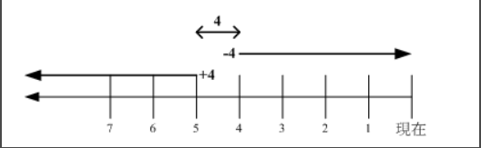

## 文件搜索

### 1. which

指令搜索。

```html
# which [-a] command
-a ：将所有指令列出，而不是只列第一个
```

### 2. whereis

文件搜索。速度比较快，因为它只搜索几个特定的目录。

```html
# whereis [-bmsu] dirname/filename
```

### 3. locate

文件搜索。可以用关键字或者正则表达式进行搜索。

locate 使用 /var/lib/mlocate/ 这个数据库来进行搜索，它存储在内存中，并且每天更新一次，所以无法用 locate 搜索新建的文件。可以使用 updatedb 来立即更新数据库。

```html
# locate [-ir] keyword
-r：正则表达式
```

### 4. find

文件搜索。可以使用文件的属性和权限进行搜索。

```html
# find [basedir] [option]
example: find . -name "shadow*"
```

**① 与时间有关的选项**  

```html
-mtime  n ：列出在 n 天前的那一天修改过内容的文件
-mtime +n ：列出在 n 天之前 (不含 n 天本身) 修改过内容的文件
-mtime -n ：列出在 n 天之内 (含 n 天本身) 修改过内容的文件
-newer file ： 列出比 file 更新的文件
```

+4、4 和 -4 的指示的时间范围如下：



**② 与文件拥有者和所属群组有关的选项**  

```html
-uid n
-gid n
-user name
-group name
-nouser ：搜索拥有者不存在 /etc/passwd 的文件
-nogroup：搜索所属群组不存在于 /etc/group 的文件
```

**③ 与文件权限和名称有关的选项**  

```html
-name filename
-size [+-]SIZE：搜寻比 SIZE 还要大 (+) 或小 (-) 的文件。这个 SIZE 的规格有：c: 代表 byte，k: 代表 1024bytes。所以，要找比 50KB 还要大的文件，就是 -size +50k
-type TYPE
-perm mode  ：搜索权限等于 mode 的文件
-perm -mode ：搜索权限包含 mode 的文件
-perm /mode ：搜索权限包含任一 mode 的文件
```

