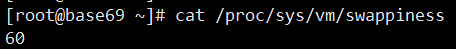

Linux observability tools | Linux 性能观测工具


基础命令：uptime、top(htop)、mpstat、isstat、vmstat、free、ping、nicstat、dstat。
高级的命令：sar、netstat、pidstat、strace、tcpdump、blktrace、iotop、slabtop、sysctl、/proc。

Linux benchmarking tools | Linux 性能测评工具，对于不同模块的性能测试可以使用相应的工具


Linux tuning tools | Linux 性能调优工具，主要是从linux内核源码层进行的调优


Linux observability sar | linux性能观测工具


## 查看系统资源
查看cpu核数： cat /proc/cpuinfo
查看交换区使用策略：cat /proc/sys/vm/swappiness

swappiness的值越大，表示越积极使用swap分区，越小表示越积极使用物理内存。默认值swappiness=60


## 磁盘空间管理
df -h 命令查看磁盘空间
查看具体目录文件占用空间大小
```shell
du -s /* | sort --nr # 查看那个目录占用空间大
du -ah --max-depth=1 / # 查看当前目录下一级子文件和子目录占用的磁盘容量
du --bsh /usr/ # 查看当前目录总共占的容量。而不单独列出各子项占用的容量
lsof | grep deleted #查看删除掉的文件仍然被进程占用而没有进行实际删除
```

## ps--显示当前进程的状态  
ps参数太多，具体使用方法可以参考man ps，常用的方法：ps  aux  hsserver；ps –ef |grep hundsun
- 杀掉某一程序的方法：ps  aux | grep mysqld | grep –v grep | awk ‘{print $2 }’ xargs kill -9
- 杀掉僵尸进程：ps –eal | awk ‘{if ($2 == “Z”){print $4}}’ | xargs kill -9

## lsof -- 列出当前系统打开文件

查看文件系统阻塞  lsof /boot
查看端口号被哪个进程占用   lsof  -i : 3306
查看用户打开哪些文件   lsof –u username
查看进程打开哪些文件   lsof –p  4838
查看远程已打开的网络链接  lsof –i @192.168.34.128

[[top]]

[[vmstat]]

[[iostat]]

[[netstat]]

[[IOTOP]]


https://study.10086.fund:23350/%E6%9E%81%E5%AE%A2%E6%97%B6%E9%97%B4%E7%9A%84%E6%96%87%E7%AB%A0/12-Linux%E6%80%A7%E8%83%BD%E4%BC%98%E5%8C%96%E5%AE%9E%E6%88%98/