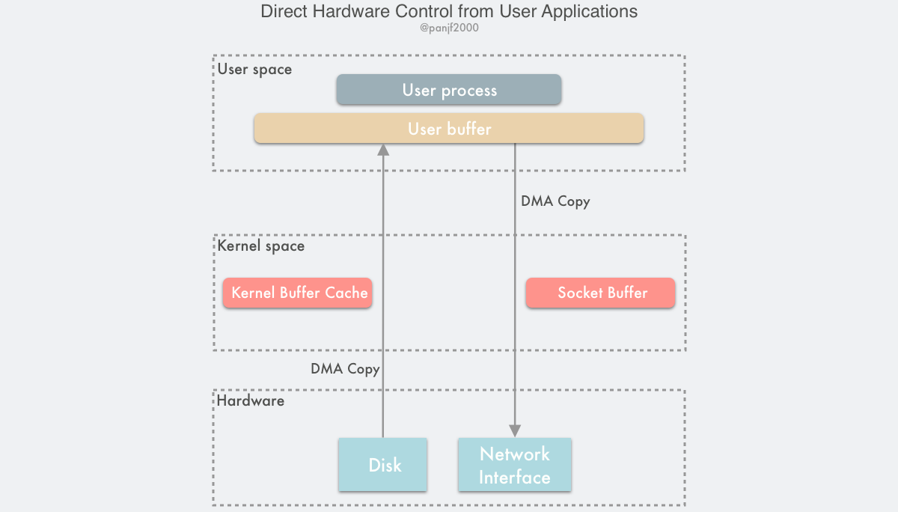

#### 绕过内核的直接 I/O

**绕过内核直接 I/O** 技术方案有两种实现方式：

1. 用户直接访问硬件
2. 内核控制访问硬件

##### 用户直接访问硬件

这种技术赋予用户进程直接访问硬件设备的权限，这让用户进程能有直接读写硬件设备，在数据传输过程中只需要内核做一些虚拟内存配置相关的工作。该方案破坏了现代计算机操作系统中的硬件抽象。

直接硬件访问技术给程序设计带来了各种限制：由于设备之间的数据传输是通过 DMA 完成的，因此用户空间的数据缓冲区内存页必须进行 page pinning（页锁定），这是为了防止其物理页框地址被交换到磁盘或者被移动到新的地址而导致 DMA 去拷贝数据的时候在指定的地址找不到内存页从而引发缺页错误，而页锁定的开销并不比 CPU 拷贝小，所以为了避免频繁的页锁定系统调用，应用程序必须分配和注册一个持久的内存池，用于数据缓冲。

这种直接 I/O 技术虽然有可能非常高效，但是它的适用性也非常窄，目前只适用于诸如 MPI 高性能通信、丛集计算系统中的远程共享内存等有限的场景。

##### 内核控制访问硬件

相较于用户直接访问硬件技术，通过内核控制的直接访问硬件技术更加的安全，它比前者在数据传输过程中会多干预一点，但也仅仅是作为一个代理人这样的角色，不会参与到实际的数据传输过程，内核会控制 DMA 引擎去替用户进程做缓冲区的数据传输工作。同样的，这种方式也是高度依赖硬件的，比如一些集成了专有网络栈协议的网卡。

这种技术也有着和用户直接访问硬件技术一样的问题：DMA 传输数据的过程中，用户进程的缓冲区内存页必须进行 page pinning 页锁定，数据传输完成后才能解锁。CPU 高速缓存内保存的多个内存地址也会被冲刷掉以保证 DMA 传输前后的数据一致性。

