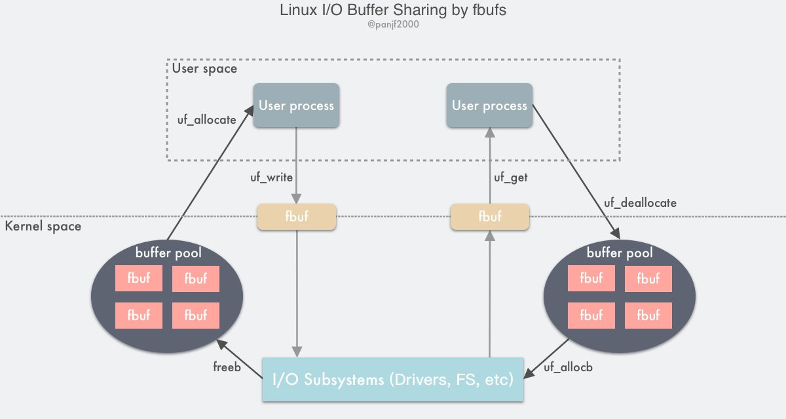

## 缓冲区共享 (Buffer Sharing)

操作系统内核开发者们实现了一种叫 fbufs 的缓冲区共享的框架，也即**快速缓冲区（ Fast Buffers ）**，

使用一个 fbuf 缓冲区作为数据传输的最小单位，用户区和内核区、内核区之间的数据都必须严格地在 fbufs 这个体系下进行通信。

fbufs 为每一个用户进程分配一个 buffer pool，里面会储存预分配好的 buffers，这些 buffers 会被同时映射到用户内存空间和内核内存空间。
fbufs 只需通过一次虚拟内存映射操作即可创建缓冲区，有效地消除那些由存储一致性维护所引发的大多数性能损耗。

> 传统的 Linux I/O 接口是通过把数据在用户缓冲区和内核缓冲区之间进行拷贝传输来完成的，这种数据传输过程中需要进行大量的数据拷贝，
> 由于虚拟内存技术的存在，I/O 过程中还需要频繁地通过 MMU 进行虚拟内存地址到物理内存地址的转换，高速缓存的汰换以及 TLB 的刷新，这些操作均会导致性能的损耗。
> 而如果利用 fbufs 框架来实现数据传输的话，首先可以把 buffers 都缓存到 pool 里循环利用，而不需要每次都去重新分配，
> 而且缓存下来的不止有 buffers 本身，而且还会把虚拟内存地址到物理内存地址的映射关系也缓存下来，也就可以避免每次都进行地址转换，

1. 发送方用户进程调用 `uf_allocate` 从自己的 buffer pool 获取一个 fbuf 缓冲区，往其中填充内容之后调用 `uf_write` 向内核区发送指向 fbuf 的文件描述符；
2. I/O 系统接收到 fbuf 之后，调用 `uf_allocb` 从接收方用户进程的 buffer pool 获取一个 fubf 并用接收到的数据进行填充，然后向用户区发送指向 fbuf 的文件描述符；
3. 接收方用户进程调用 `uf_get` 接收到 fbuf，读取数据进行处理，完成之后调用 `uf_deallocate` 把 fbuf 放回自己的 buffer pool。

