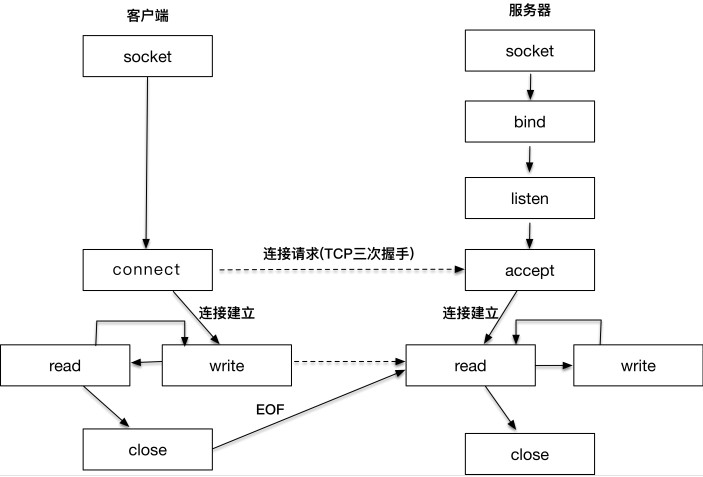
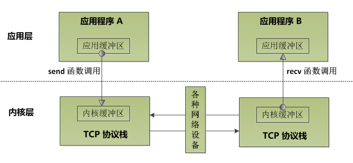

Socket 对网络中不同主机上的应用进程之间进行双向通信的端点的抽象。

Socket之间建立连接并通信的过程

1. 服务端Socket绑定`bind`到指定的端口上后监听`listen`客户端的插入
2. 客户端Socket连接到`connect`到服务端
3. 当服务端`accept`到客户端连接后
4. 客户端与服务端之间收发信息开发通信
5. 通信完成后客户端与服务器关闭`close`掉Socket

当进程A执行到创建socket的语句时，操作系统会创建一个由文件系统管理的socket对象。包含发送缓冲区、接收缓冲区、等待队列等成员。等待队列指向所有需要等待该socket事件的进程。

发送数据(send)是将应用层发送缓冲区的数据拷贝到内核缓冲区。

> TCP/IP 协议栈确定从网卡缓冲区发送到网络的时机。 比如nagel 算法和 TCP_NODELAY 的 socket 选项

接收数据(recv)是将内核缓冲区中的数据拷贝到应用程序的缓冲区中。

**缓冲区特性**：
1. I/O缓冲区在每个TCP套接字中单独存在；
1. I/O缓冲区在创建套接字时自动生成；
1. 即使关闭套接字也会继续传送输出缓冲区中遗留的数据；
1. 关闭套接字将丢失输入缓冲区中的数据。

TCP被叫做字节流套接字（Stream Socket）

UDP被叫做数据包套接字（Datagram Socket）

**网络编程的核心 = IO模型 + 线程或进程模型**

[[字节序]]

[[Linux的TCP连接建立]]

[[C10K问题]]

[[C1000K问题]]

[[C10M问题]]