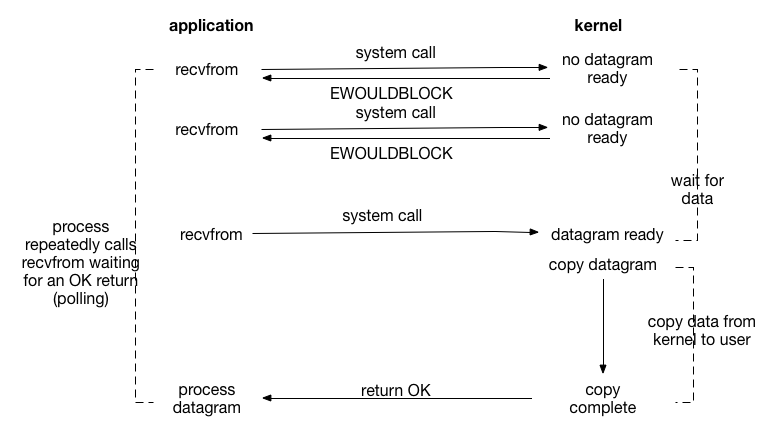

用户进程发起阻塞型的系统调用时只有当操作成功或发生异常时才会从内核态返回用户态。当用户进程发起非阻塞系统调用时无论是否操作成功都会立即从内核态返回用户态，需要循环调用并依据不同的结果做处理。

### 阻塞IO（Blocking IO）

线程方案：在服务器端使用阻塞I/O模型时结合**多进程/多线程**技术。让每一个连接都拥有独立的进程/线程，任何一个连接的阻塞都不会影响到其他连接。无法适用大量连接的情况。

### 非阻塞IO（Non-blocking IO）

问题：轮询的频率比较难控制。低频率的轮询则可能导致程序响应I/O事件的延迟难以接受。高频率的轮询则可能导致**浪费CPU时间**

线程方案：服务端使用单一线程统一轮询所有的的IO事件，如果检测到事件再交给其他业务线程处理。

### 阻塞IO对比非阻塞IO

