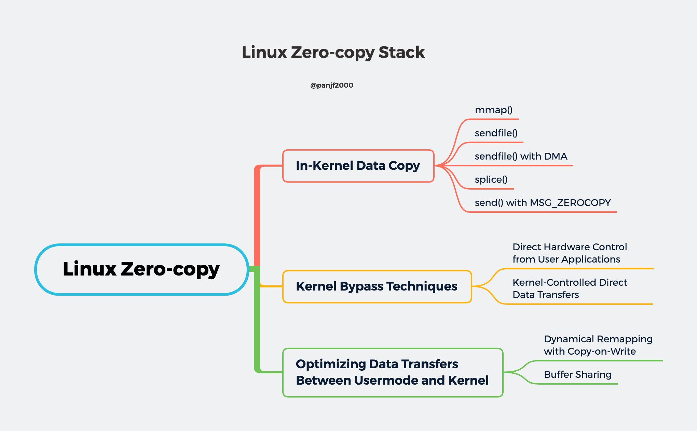

## 零拷贝 (Zero-copy)

零拷贝技术是指计算机执行操作时，CPU不需要先将数据从某处内存复制到另一个特定区域。这种技术通常用于通过网络传输文件时节省CPU周期和内存带宽。

在 Linux 平台上有很多的 zero-copy 技术，新旧各不同，可以归纳成大致的以下三类：

- **减少用户空间和内核空间之间的数据拷贝**：在一些场景下，用户进程在数据传输过程中并不需要对数据进行访问和处理，那么数据在 Linux 的 `Page Cache` 和用户进程的缓冲区之间的传输就完全可以避免，让数据拷贝完全在内核里进行，比如 Linux 中的 mmap()，sendfile() 以及 splice() 等。

- **内核缓冲区和用户缓冲区之间的传输优化**：侧重于在用户进程的缓冲区和操作系统的页缓存之间的 CPU 拷贝的优化。

- **绕过内核的直接 I/O**：允许在用户态进程绕过内核直接和硬件进行数据传输，内核在传输过程中只负责一些管理和辅助的工作。

[[减少传输]]

[[传输优化]]

[[绕过内核的直接 IO]]

参考：https://strikefreedom.top/linux-io-and-zero-copy